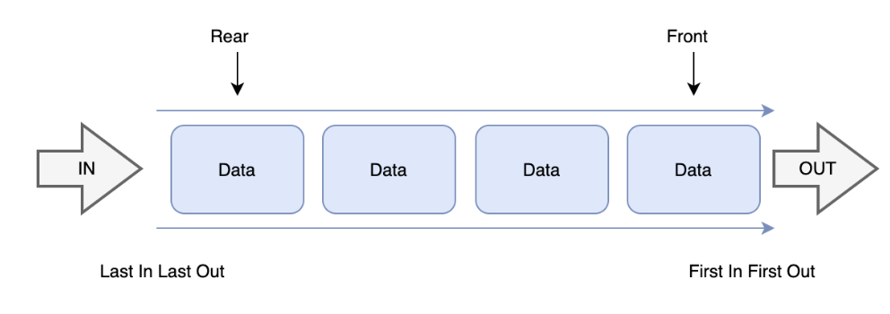
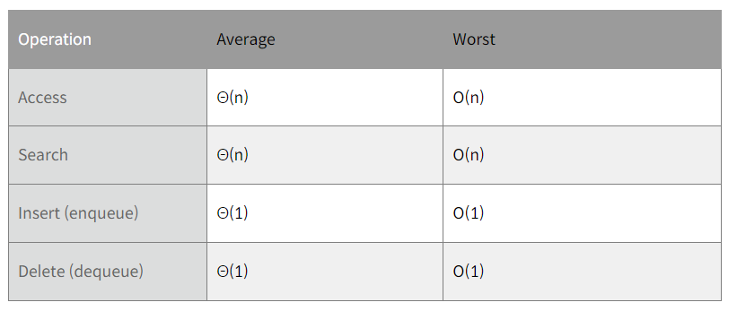

## **Queue (큐)**

### 특징

먼저 넣은 데이터가 먼저 나오는 FIFO (First In First Out) 구조로 저장하는 선형 자료구조

스택(Stack)과는 반대되는 개념

큐에 `끝(Rear)`에서 요소를 추가하는 작업을 `enqueue`라고 하며 큐에 `맨 앞(Front)`에서 요소를 제거하는 작업을 `dequeue`라고 합니다.

가득 찬 큐에 요소를 추가하려고 할 때 `Overflow`가 발생하며, 빈 큐에서 요소를 제거하려고 할 때 `Underflow`가 발생합니다

### 기본 연산

- enqueue() - 큐에 끝(rear)에 항목을 추가
- dequeue() - 큐에 맨 앞(front)에 항목을 제거
- peek() - 큐에 맨 앞(front)에 있는 항목을 반환
- isfull() - 큐가 가득 찼는지 확인
- isempty() - 큐가 비어 있는지 확인.

### 시간복잡도

### 종류

- 선형 큐
    
    위에서 본 사진과 동일한 형태
    
    - 배열 구현 시 크기가 제한되어 있다.
    - 빈 공간을 사용하려면 모든 자료를 꺼내거나 자료를 한 칸씩 옮겨야 한다. (지연시간 발생)
    - 빈 공간이 있음에도 REAR가 마지막을 가리켜(한칸씩 안 옮겨줘서) 다 채워진 상태로 인식할 수도 있다.
- 원형 큐
    
    1차원 배열 형태의 큐를 원형으로 구성하여 배열의 처음과 끝을 연결한 형태
    
    데이터가 배열의 끝에 다다르면 다시 처음으로 돌아올 수 있어 이미 사용했던 부분도 재사용 가능 (선형 큐와 달리 메모리 낭비X)
    

