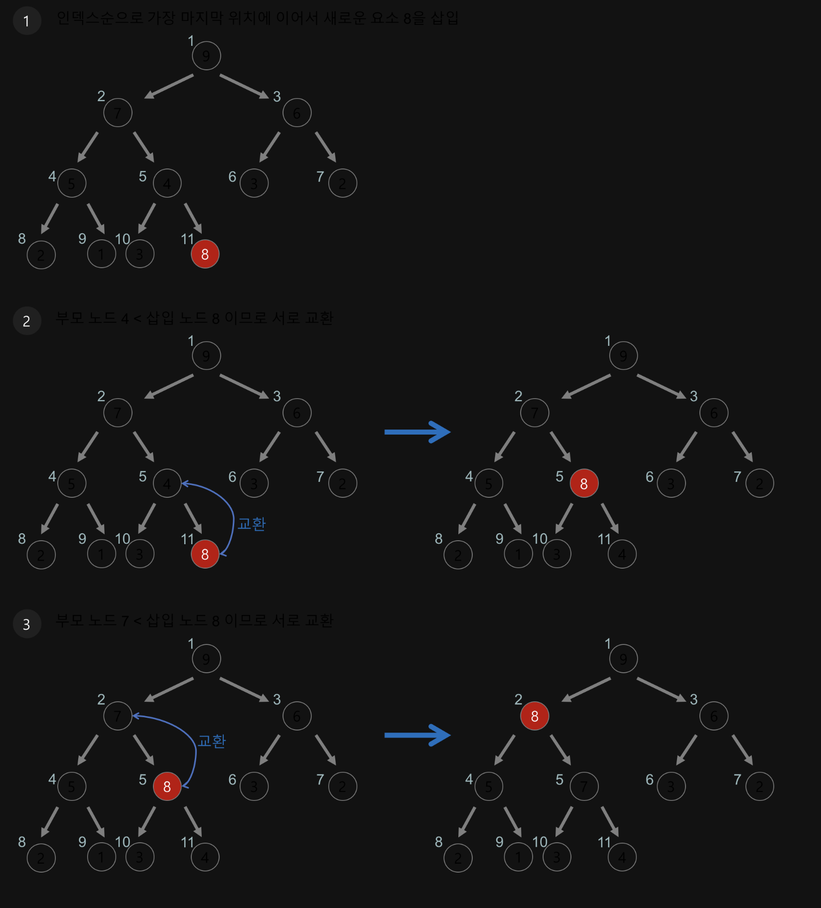
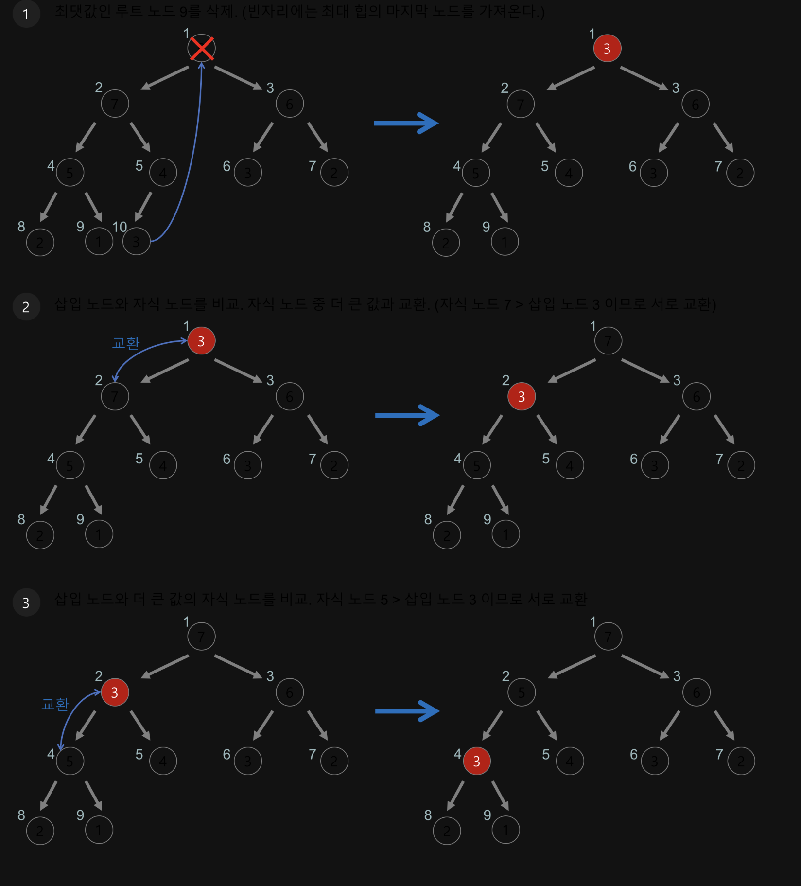

# Binary Heap (이진힙)

## 1. 힙이란?

 먼저, 힙은  **최댓값 및 최솟값을 찾아내는 연산**을 빠르게 하기 위해 고안된 완전 이진트리(complete binary tree)를 기본으로 한 자료구조다. 

- 힙을 저장하는 표준적인 자료구조는 **배열**이다.
- 구현을 쉽게 하기 위하여 배열의 첫 인덱스인 0은 사용되지 않는다.
- 힙에서 부모노드와 자식 노드의 관계
    - *왼쪽 자식의 인덱스 = (부모의 인덱스)* 2
    - 오른쪽 자식의 인덱스 = (부모의 인덱스) * 2 + 1
    - 부모의 인덱스 = (자식의 인덱스) / 2
- 전체 노드의 수
    - 2^(n-1) - 1 < 전체 노드의 수 < 2^n - 1  ( n = level)
    
    전체 노드의 수는 반복문의 횟수를 결정한다. 
    

## 2. 힙의 종류

- **최대 힙(max heap) :** 부모 노드의 키 값이 자식 노드의 키 값보다 크거나 같은 완전 이진 트리
    - key(부모노드 >= key(자식노드)
    - **내림차순**
- **최소 힙(min heap) :** 부모노드의 키 값이 자식노드의 키 값보다 작거나 같은 완전 이진 트리
    - key(부모노드) <= key(자식노드)
    - **오름차순**

최솟값이나 최댓값을 찾기 위해 **배열을 사용하면 Ο(n)만큼** 시간이 걸리지만,

하지만 힙을 사용하면 **O(logn)**만큼 소요되므로, 배열을 사용할 때 보다 빠르게 최솟값과 최댓값을 구할 수 있다.

## 3. 이진힙

이진 힙은 힙 중에서 가장 널리 쓰이는 형태 중 하나로 이진 트리 형태인 힙이다. 이진 트리는 각 노드의 자식 노드가 반드시 2개 이하인 트리다.

**이진 힙은 완전 이진 트리 조건을 만족해야 한다.** 

(완전 이진 트리는 모든 레벨의 노드가 채워져 있어야 하며, 마지막 레벨은 왼쪽부터 차 있어야 한다.)

## 4. 힙의 정렬(삽입, 삭제)

### 삽입(Insert)  ⇒ 최하위 노드에 삽입

새로운 요소가 추가하기 위해서는 우선 트리의 가장 마지막 노드에 넣어준다.

그 후 부모 노드와 비교해서 작으면 부모와 위치를 교환하고, 반복해준다.

노드의 자식은 2개까지 가질 수 있다.

다음은 8을 최대 힙에 추가하는 과정이다.

1. 원소를 힙의 가장 마지막 노드에 추가.
2. 추가한 원소를 부모와 비교. 순서가 힙 조건과 일치한다면 중지.
3. 힙 조건과 순서가 맞지 않다면 부모와 위치를 교환. 힙 조건일 일치할 때까지 반복.
    
    
삭제(Delete) ⇒ 항상 루트 노드를 삭제
    
다음은 최대 힙에서 삭제를 하는 과정이다. 
    

    
1. root 노드 삭제 
2. 리프 노드를 루트로 이동. 루트를 자식 노드와 비교. 이 때, 두 자식 노드 중 최대 힙인 경우 더 큰 자식과 비교하며 최소 힙인 경우 더 작은 자식과 비교함. 순서가 힙 조건과 일치한다면 중지.
3. 만약 순서가 맞지 않는다면 위치를 교환. 힙 조건일 일치할 때까지  반복.