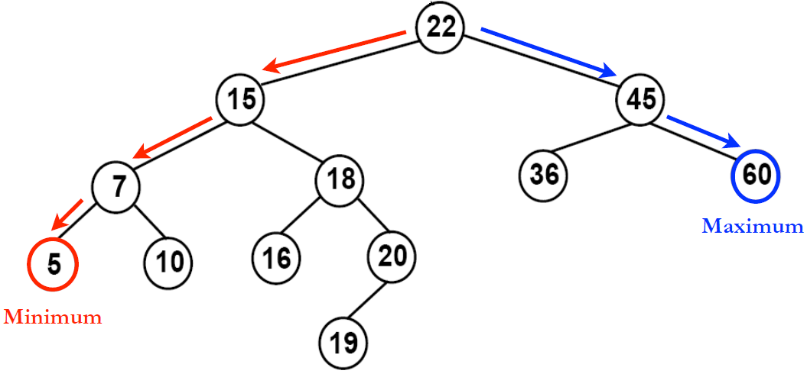
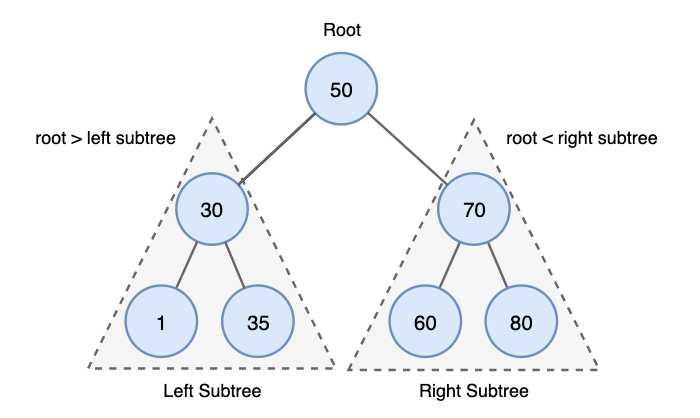
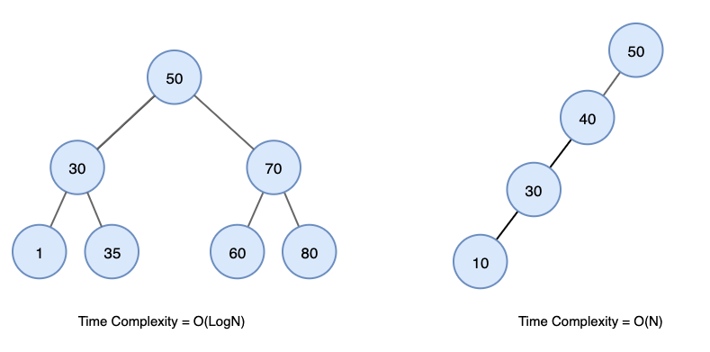
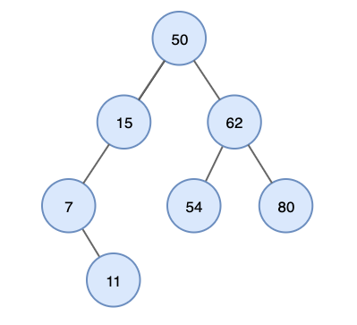
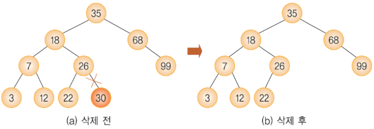
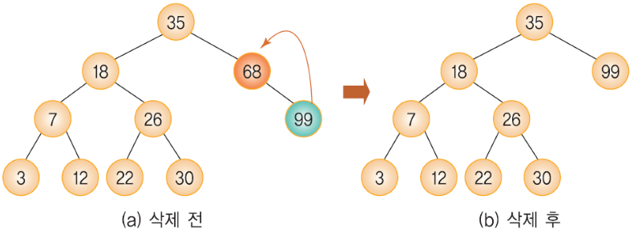
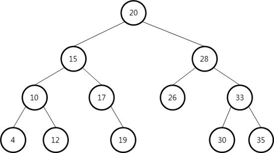

# Binary Search Tree(이진탐색트리)

## 1. 이진탐색트리란?

: 이진 탐색이 항상 동작하도록 구현하여 **탐색 속도를 극대화** 시킨 자료구조

이진 탐색 트리는 다음과 같은 규칙을 따른다. 

✅ 노드의 왼쪽 하위 트리에는 노드의 키보다 작은 키가있는 노드 만 포함된다

✅ 노드의 오른쪽 하위 트리에는 노드의 키보다 큰 키가있는 노드 만 포함된다.

✅ 중복된 키를 허용하지 않는다.

이진탐색트리는 다음과 같은 특성을 갖는다. 

1. **BST의 검색에 대한 시간복잡도는 균형 상태이면 O(logN)의 시간이 걸리고 불균형 상태라면 최대 O(N) 시간이 걸린다.**

1. **BST를 중위순회를 수행하여 모든 키를 정렬된 순서로 가져올 수 있다.**

이 때 찾고자 하는 값이 부모 노드보다 작을 경우 왼쪽 자식으로, 찾고자 하는 값이 부모 노드보다 클 경우 오른쪽 자식으로 이어 나가면서 방문한다

위 트리에 inorder traversal 결과  (7, 11, 15, 50, 54, 62, 80)

## 2. 이진탐색트리  연산 (탐색, 삽입, 삭제)

위에서 루트 노드를 기준으로 왼쪽 서브 트리의 key값은 루트 노드보다 작고, 오른쪽 서브 트리의 key값은 루트 노드보다 크다고 했다. 따라서 이진 탐색 트리를 중위순회하면 **오름차순** 정렬된다. 

### 2-1. 탐색 연산

탐색연산을 하기 위해서는 먼저 타겟 데이터가 존재하는 지 확인해야 한다. 

**찾고자하는 값과 현재 루트 노드의 값 비교**

→ 타겟 값이 더 크다면 **오른쪽 서브 트리로**

→ 타겟 값이 더 작다면 **왼쪽 서브 트리로**

위 로직을 재귀적으로 반복 수행하여, **루트 노드의 값이 타겟 데이터일 때 까지 탐색**한다.

### 2-2. 삽입 연산

삽입 연산을 위해서는  탐색 연산이 선행되어야 한다. (삽입 하려는 데이터가 이미 존재하는 경우 삽입을 할 수 없기 때문이다.)

따라서 탐색에 실패한 그 위치가 삽입할 위치가 된다. 

**새로운 데이터가 들어갈 자리가 비어있으면 그대로 값을 대입**하면 된다. 

비어있지 않은 경우 **해당 자리의 노드 값과 비교**→ 삽입할 데이터보다 작다면 **왼쪽 자식트리로 이동**시키고→ 삽입할 데이터보다 크다면 **오른쪽 자식 트리로 이동**하면 된다.

### 2-3. 삭제 연산

중간에 있는 노드를 삭제하는 경우 **트리가 중간에 끊기는 등의 상황**이 발생할 수 있기 때문에 이를 처리하는 방안이 있어야 한다. **삭제는 세 가지 경우**가 있을 수 있는데, 이에 따라 다르게 대처한다.

**1. 리프 노드를 삭제하는 경우**

→ 그냥 삭제하면 됨

**2. 자식노드가 하나인 노드를 삭제 하는 경우** 

→ 해당 노드를 삭제하고 서브 트리를 부모 노드(삭제된 위치)에 붙여준다.

**3.   자식 노드가 두 개인 노드를 삭제하는 경우**

마지막 세 번째의 경우는 조금 복잡하다. 

자식 노드를 가지고 있는 노드를 삭제하면, 그 밑의 자식 노드들은 연결이 끊어지게 된다. 이 때 자식 노드들 중 후계자를 찾아 삭제된 노드의 위치에 넣어주어 연결을 유지하는 후속 처리를 해줘야 한다.

이를 위해 삭제되는 노드와 가장 값이 비슷한 노드를 후계자로 선택해야 한다. 

→ **오른쪽 서브 트리의 MIN 값 OR 왼쪽 서브 트리의 MAX 값** 중 하나를 삭제할 노드의 위치로 끌어올림

먼저 그림을 보며 설명하자면, 삭제할 노드가 자식 노드를 두 개 가진 경우는 위 트리 중 20, 15, 10, 28, 33이 될 수 있다. 이 중 노드 15를 삭제한다고 가정하자. 15가 삭제된다면 자식 노드인 10과 17 그리고 그 밑에 있는 자식노드들과 루트 20 사이의 연결이 끊어진다.

이 연결을 유지 시키기 위해 자식 노드 사이에서 후계자를 찾아야 하는데 후계자를 찾는 방법에는 두 가지가 있다고 앞서 얘기했다. 

- 왼쪽 자식 노드 중 가장 큰 노드 찾기 (가장 오른쪽에 있는 키 값)  → 12
- 오른쪽 자식 노드 중 가장 작은 노드 찾기  (가장 왼쪽에 있는 키값) → 17

여기서는 첫 번째 방법을 선택할 것이다. 두 방법 중 어떤 것을 선택하는지는 자유다.

노드 15를 삭제 했을 때 왼쪽 자식 노드 중 가장 큰 값인 12를 15의 자리에 넣게 되면 이진 트리의 조건을 그대로 만족한다. ( = 오른쪽 자식 노드에서 가장 작은 값인 17을 넣어도 만족)

## 3. 힙 vs 이진 탐색 트리

### 공통점

- 모두 완전 이진 트리이다.

### 차이점

- (최대힙의 경우) 힙은 각 노드의 값이 자식 노드보다 크거나 같다.
- 이진 탐색 트리는 각 노드의 왼쪽 자식은 더 작은 값으로, 오른쪽 자식은 더 큰 값으로 이루어져있다.`왼쪽 자식 노드 < 부모 노드 < 오른쪽 자식 노드`
- 힙은 왼쪽 노드의 값이 크든 오른쪽 노드의 값이 크든 상관 없다.
- 힙은 최대/최소 검색을, 이진 탐색 트리는 탐색을 위한 구조이다.

