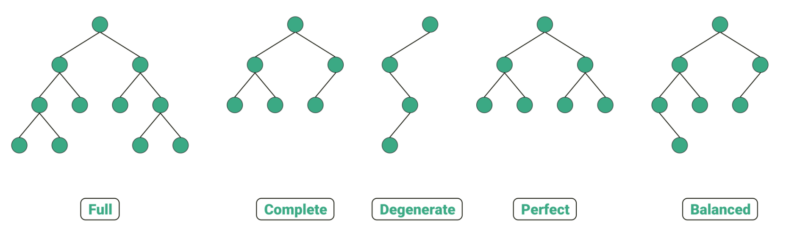
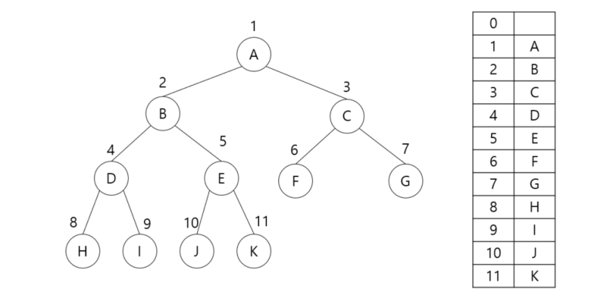
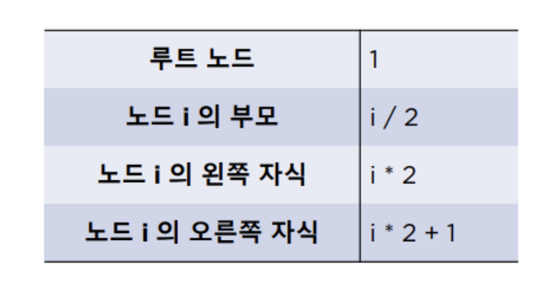
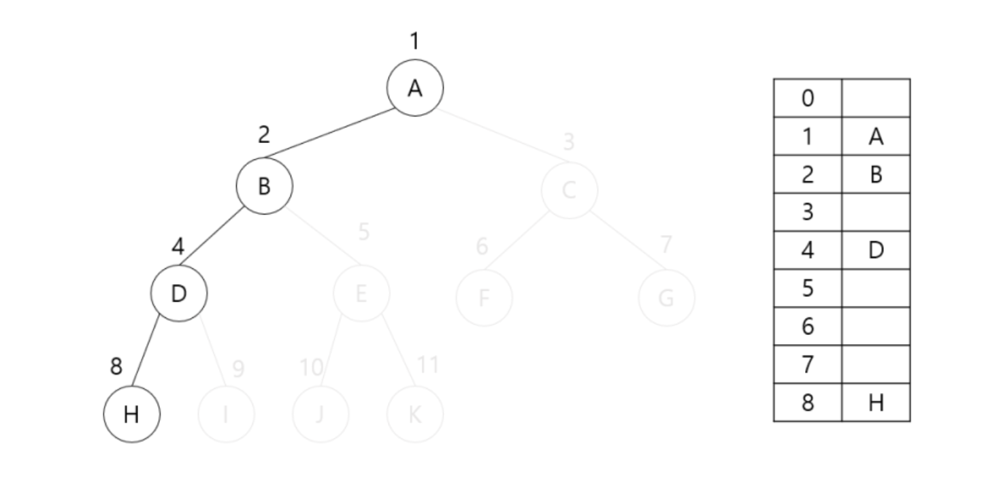
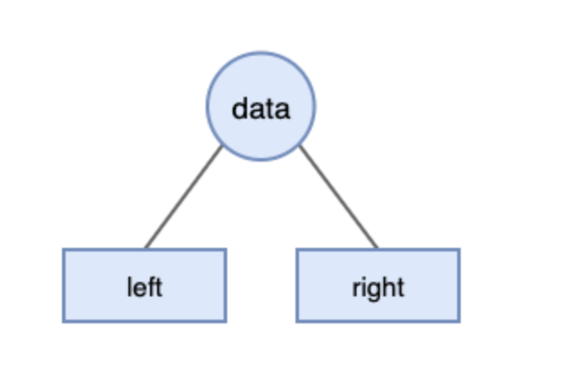
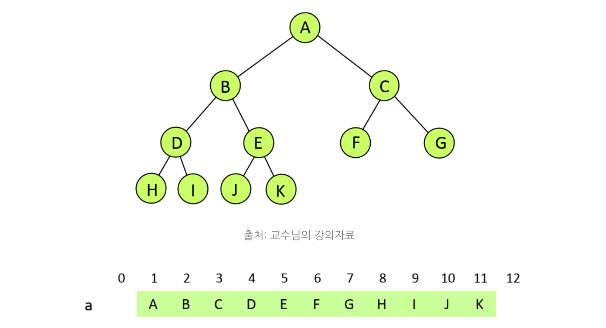
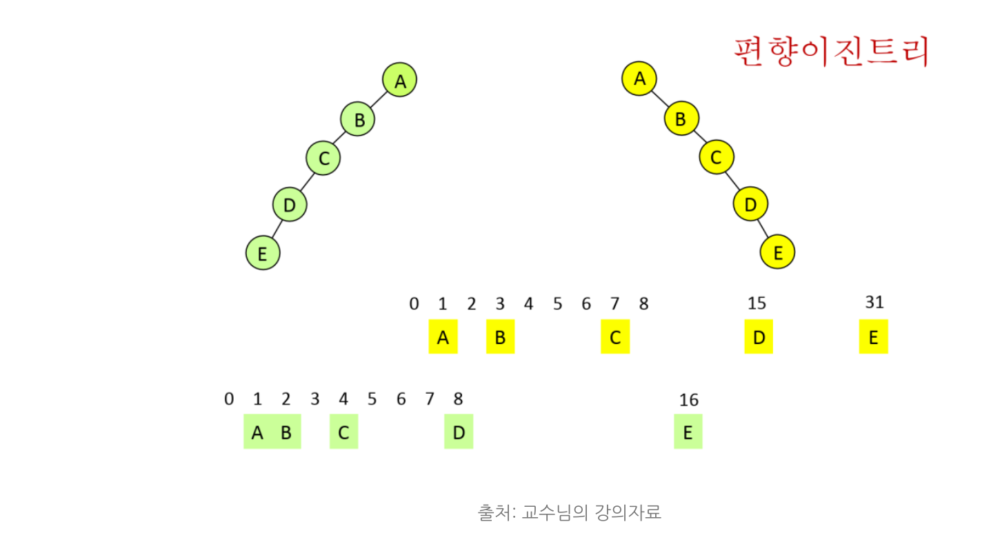

# Binary Tree (이진 트리)

## 1. 이진트리 (binary tree)란?

이진트리에서 각 노드는 최대 2개**(0,1,2 개)의 자식을 가진다.** 

2개의 자식노드 중에서 **왼쪽의 노드를 `Left Node`**라고 하고, **오른쪽의 노드를 `Right Node`**라고 한다.

## 2. 이진트리 종류

### 2-1. Perfect binary tree 포화 이진 트리

**모든 리프 노드의 레벨이 동일하고, 모든 레벨이 가득 채워져 있는 트리**이다.

✅ 레벨 k에 있는 최대 노드의 수는 2^(k-1)이다. (단 k = 1,2,3…)

✅ 높이가 h인 포화 이진트리에서 **노드 갯수는 2^(k+1) -1의 특징**을 갖는다.

레벨 k에 있는 최대 노드의 2^(k-1)인데, 쉽게 말해서 3층에 있는 노드들은 4개를 넘길 수 없다. 

위 이미지의 경우 높이가 3인 포화 이진 트리는 $2^3−1=7$ 개의 노드를 가진다.

### 2-2. Complete binary tree 완전 이진 트리

이진 트리에 노드를 삽입할 때 왼쪽부터 차례대로 삽입하는 트리이다.

마지막 레벨을 제외하고 모든 노드가 가득 차 있어야 하며, 마지막 레벨의 노드는 전부 차 있지 않아도 되지만 왼쪽이 채워져야 한다.

✅ N개의 노드를 가진 완전이진트리의 높이는 $log2(N+1)$이다. 

$log2(N+1) = log2(7+1) = log2^8 = 3$

위 이미지에서 트리는 포화이진트리이므로 N은 7, 7+1은 8이고 , 8은 2의 3승이므로 높이는 3이다. 

왼쪽의 트리는 왼쪽부터 노드가 채워져있기 때문에 완전 이진트리라고 할 수 있지만 오른쪽의 트리는 레벨 3에서 왼쪽부터 노드가 채워져있지 않기 때문에 완전 이진 트리라고 할 수 없다.

### 2-3. Skewed binary tree 편향 이진 트리

왼쪽 또는 오른쪽으로 편향되게 채워져있는 트리이며, 매우 비효율적인 자료구조를 가졌다. 

### 2-4. Full binary tree 정 이진 트리

정 이진 트리는 모든 노드가 0 개 또는 2개의 자식 노드만을 갖는 트리이다.

A는 B 와 C로 2개의 자식 노드, B는 D와 E로 2개의 자식 노드, C는 0개의 자식 노드를 가지고 있기 때문에 정 이진 트리가 된다.

### 2-5. Balanced binary tree 균형 이진 트리

균형 이진 트리는 모든 노드의 왼쪽과 오른쪽 서브 트리의 높이가 1 이상 차이가 나지 않는 트리이다.

왼쪽의 트리들은 왼쪽과 오른쪽의 서브 트리의 높이가 1 이상 차이가 나지 않는것을 볼 수 있다.

하지만 오른쪽의 트리들은 왼쪽과 오른쪽의 서브 트리의 높이가 1이상 차이가 나기 때문에 균형 이진 트리라고 할 수 없다.

## 3. 이진트리의 표현 (배열, 리스트)

### 3-1. 배열로 표현

이진트리는 트리지만 선형자료구조인 1차원 배열로도 표현할 수 있다는 특징을 가진다. 

즉 높이가 h인 완전 이진트리는 각 노드 번호를 인덱스로 하여 1차원 배열로 구현할 수 있다. 

- 루트 노드의 인덱스는 1이다.
- 형제 노드 중 왼쪽 노드이 인덱스 순서가 오른쪽 노드보다 빠르다.

자료구조의 배열의 인덱스의 시작은 0부터이지만 루트노드의 인덱스를 1로 하기때문에 배열에서 인덱스 0인 자리는 비워둔다. 위의 그림은 완전 이진트리를 배열로 구현한 것이다. 이렇게 배열로 구현된 이진트리는 인덱스를 이용해 노드를 탐색한다. 

- 부모 노드의 인덱스가 n일 때, 왼족 자식의 노드의 인덱스: 2i, 오른쪽 자식 노드이 인덱스: 2i+1
- 자식 노드의 인덱스가 n일 때, 부모 노드이 인덱스: i/2

편향이진트리의 경우 배열에 빈자리가 발생하게 되는데, 이는 메모리 낭비를 초래할 수 있으며 매우 비효율적인 자료구조이다. 

또한 트리 중간에 노드를 삽입하거나 삭제하는 경우에도 i 이후에 위치하고 있는 노드들의 수만큼 연산과 이동시간이 필요하게 된다. 

### 3-2. 연결리스트로 표현

 연결리스트의 노드는 아래와 같이 하나의 데이터 영역과 두 개의 포인터 영역으로 구성된다. 

연결리스트는 배열보다 접근속도가 느리지만 삽입, 삭제가 쉽고 포인터로 연결하기 때문에 노드 수에 제한이 없다. 

완전이진트리는 마지막 레벨을 제외한 나머지가 모두 2개의 노드 쌍으로 이루어져 있기 때문에

마찬가지로 리스트 중간이 비어있을 수가 없다. 

1부터 시작하며 루트를 리스트의 첫 번째에 넣고 레벨이 같은 노드 B와 C가 A의 다음으로 들어가고, 세 번째 레벨에서 D, E, F, G가 순서대로 들어간다. (1부터 채우는 이유는 계산을 쉽게하기 위함이라 한다. ) 

✅ a[i]의 부모는 a[i/2]에 있다. (단, i>1)

✅ a[i]의 왼쪽자식은 a[2i]에 있다. (단, 2i ≤ N)

✅ a[i]의 오른쪽 자식은 a[2i + 1]에 있다. (단, 2i + 1 ≤ N)

이러한 특성을 응용하면 위와 같은 공식이 만들어지는데, 이를 통해 어느 노드가 부모고, 자식인지 알 수 있다. 

루트노드는 첫 번째 인덱스, 거기에 2를 곱하면 왼쪽 자식인 B가, 곱한 수에 1을 더한 인덱스에는 오른쪽 자식인 C가 나온다. 그리고 B의 인덱스인 2, C의 인덱스인 3에 2를 나누면 1로 맞아 나누어 떨어지거나, 나머지 1이 남지만 결국 몫은 1이된다. 

단, 모든 인덱스는 모든 노드의 수 N을 초과하지 않는다. 

편향이진트리는 매우 비효율적인 자료구조를 가졌으며 이는 메모리 낭비로 이어진다.