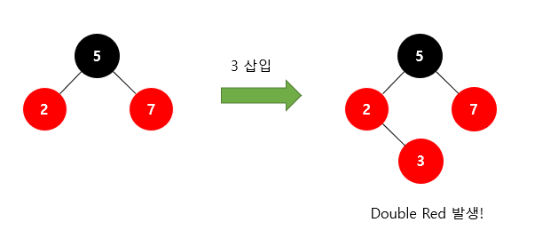
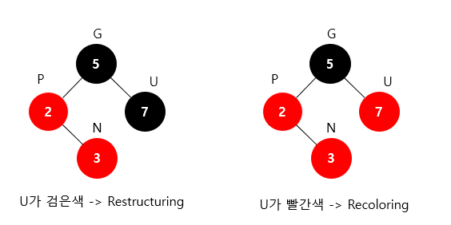
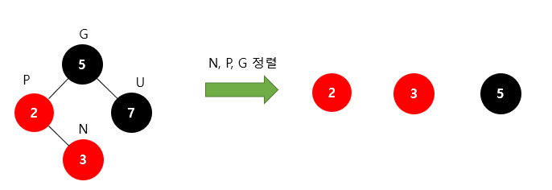
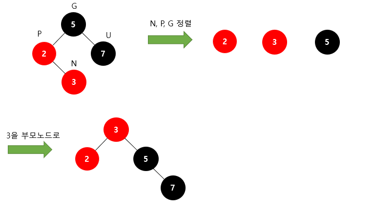
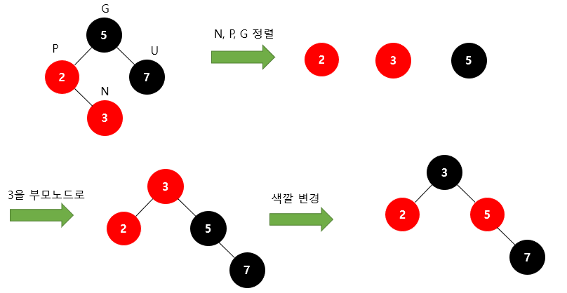
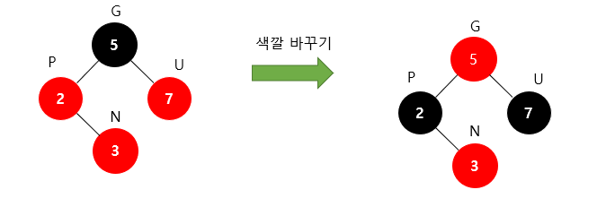
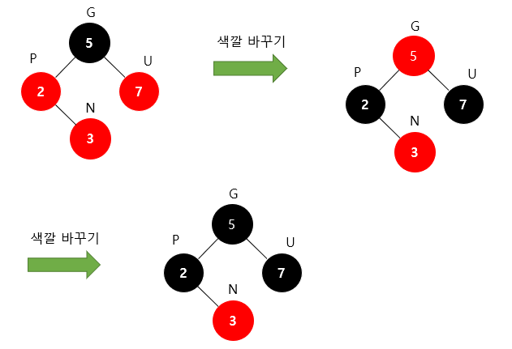
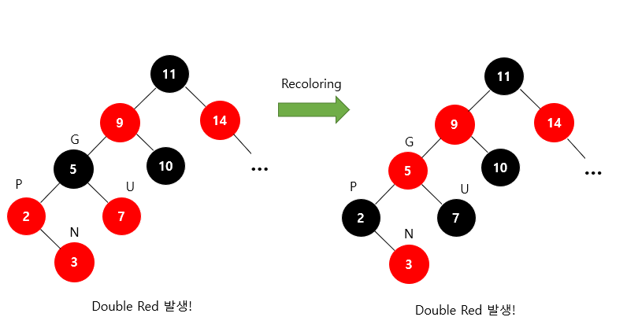
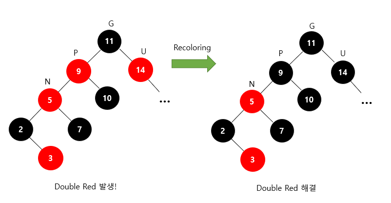

# Red Black Tree (레드 블랙 트리)

## 1. Red Black Tree란?

이진 탐색 트리의 문제점인 편향된 트리의 문제점을 해결하여 자료가 삽입 된 후 스스로 균형을 잡는 트리이다.

<자가 균형 이진탐색트리(Self-balancing binary search tree)> 라고도 부른다.

예를 들어 다음과 같이 정렬된 자료를 이진 탐색 트리에 삽입할 경우 시간복잡도는 O(N)이 된다.

1, 2, 3, 4, 5를 순차적으로 삽입 할 경우

레드 블랙 트리에서는 삽입 후 노드의 재배치를 통해 편향된 트리를 교정할 수 있다.

레드 블랙 트리에 1, 2, 3, 4, 5를 순차적으로 삽입할 경우

## 2. 용어

**1) nil node (leaf)**

그림에서 사각형으로 된 리프 노드는 여기서 nil node라고 부른다. 이 노드는 따로 key나 data를 포함하지 않으며 실제 코드에서도 구현하지 않는 "완전 가상의 노드"다. 

즉, nil node는 존재하지 않음을 의미하고 값이 있는 노드와 동등하게 취급한다. 

2**) black height**

**black height**는 **루트 노드에서부터 nil 노드까지 경로에 있는 검은 노드의 개수**다. 이 때 자기 자신은 카운트에서 제외한다. 

## 3. 규칙

RB Tree의 속성, 즉 관계된 **모든 연산에서 지켜야 할 규약이다.** 

1. 모든 노드는 **red** or **black**
2. 루트 노드는 **black**
3. 모든 nil(leaf)노드들은 **black**
4. **red**의 자녀들은 반드시 **black**.
   == No Double Red (빨간색 노드가 연속으로 나올 수 없다)
5. 모든 리프 노드에서 Black Depth는 같다.
   == 리프노드에서 루트 노드까지 가는 경로에서 만나는 **black**의 개수가 같다.

노드가 새롭게 삽입 될 시 4번 규칙과 5번 규칙을 위반하는 경우가 생기고, 

이러한 규칙 위반이 생기면 트리를 회전하거나 노드들의 색깔을 바꿔주며 트리의 균형을 맞춰주게 된다.

 

## 4. 삽입 / 삭제

삽입 삭제시 주로 #4,#5를 위반하며 이들을 해결하려고 구조를 바꾸다 보면 자연스럽게 트리의 균형이 잡히게 된다. 

삽입 동작 방식은 다음과 같다. 즉, BST와 동일하게 삽입하고 트리 속성을 만족하도록 조정하는 것이다. 

단, 삽입하는 노드는 항상 **red**다. 

### 4-1. **레드블랙트리의 노드 삽입**

레드-블랙 트리에 새로운 노드를 삽입할 때 새로운 노드는 항상 red로 삽입한다.

이렇게 되면 4번 조건이 위배되는 상황이 발생한다. 즉,빨간색 노드가 연속으로 2번 나타날 수 있다(Double Red)

레드 블랙 트리는 이러한 Double Red 문제를 해결하기 위해 2가지 전략을 사용한다.

앞으로 새로 삽입할 노드를N(New), 부모 노드를P(Parent), 조상 노드를G(Grand Parent), 삼촌 노드를U(Uncle)라고 하자. 즉, 삼촌 노드는 말 그대로 부모의 형제라고 생각하면 된다.

Double Red가 발생했을 때

- 삼촌 노드가 **black**이라면 -> **Restructuring**을 수행하면 된다.
- 삼촌 노드가 **red**이라면 -> **Recoloring**을 수행하면 된다.

### [****Restructuring]****

Restructuring은 다음 과정을 거친다

1. 새로운 노드(N), 부모 노드(P), 조상 노드(G)를 오름차순으로 정렬한다.
2. 셋 중 중간값을 부모로 만들고 나머지 둘을 자식으로 만든다.
3. 새로 부모가 된 노드를 **black**으로 만들고 나머지 자식들을 **red**로 만든다.

예시로 과정을 살펴보자. 

위와 같은 상황을 가정하자. Double Red가 발생했는데 삼촌 노드가 검은색이다. 따라서 Restructuring을 수행한다.먼저 새로운 노드 N과 부모 P, 조상 G를 오름차순으로 정렬한다. 그러면 3이 중간값이 된다. 

따라서 중간값인 3을 부모 노드로 바꾸고 나머지 2와 5를 자식 노드로 바꾼다.당연히 원래 5의 자식 노드였던 7은 딸려가게 된다.

마지막으로 새롭게 부모가 된 3을 검은색으로 바꿔주고 나머지 두 자식인 2, 5의 색을 빨간색으로 바꿔주면 Double Red 문제가 해결된다!!

여기서 많이들 헷갈리는 게 완성된 트리가 규칙 #3(모든 리프 노드는 검은색)을 만족하지 않는 것처럼 보일 수 있다. 값이 2인 노드는 자식 노드 NIL 2개를 가지고 있고 그 NIL들이 검은색이라고 생각하면 된다.

### [Recoloring]

Recoloring은 다음과 같은 과정을 거친다.

1. 새로운 노드(N)의 부모(P)와 삼촌(U)을 검은색으로 바꾸고 조상(G)을 빨간색으로 바꾼다.
   - 조상(G)이 루트 노드라면 검은색으로 바꾼다.
   - 조상(G)을 빨간색으로 바꿨을 때 또다시 Double Red가 발생한다면 또다시 Restructuring 혹은 Recoloring을 진행해서 Double Red 문제가 발생하지 않을 때까지 반복한다.

위와 같은 상황을 가정하자. Double Red가 발생했는데 삼촌 노드가 빨간색이다. 따라서 Recoloring을 수행한다.먼저 부모(P)와 삼촌(U)을 검은색으로 바꾸고, 조상(G)을 빨간색으로 바꾼다.

하지만 루트 노드는 검은색이라는 조건을 지켜야 하므로, 루트 노드를 검은색으로 바꾼다.

이렇게 하면 모든 조건이 지켜지면서 Double Red 문제가 해결된다.

검은색 노드는 2번 나와도 되냐고 묻는다면 Yes이다. 빨간색 노드가 2번 나오면 안 되는 것이다.

Recoloring은 간단해 보이지만 문제는 

**조상 노드(G)가 루트 노드가 아니면서, 조상 노드(G)가 또다시 Double Red 문제가 발생하는 경우**이다.

아래 예시와 함께 살펴보자. 

위와 같은 상황을 가정하자. 왼쪽 트리에서 Recoloring을 진행하면 오른쪽 트리가 된다.이때 조상 노드(G)가 또다시 Double Red가 발생하게 된다.

Double Red 문제가 발생한 "값이 5인 노드"를 기준으로 다시 한번 살펴보자.

해당 노드의 삼촌(U)이 빨간색이므로 다시 Recoloring을 진행해주면 Double Red 문제를 해결할 수 있다!

만약 해당 노드의 삼촌(U)가 검은색이었다면 Restructuring을 진행해주면 된다.

### 4-2. **레드블랙트리의 노드 삭제**

먼저, 삭제 후 RB트리 속성 위반 여부를 확인하기 위해서는,

삭제되는 색을 통해 속성위반 여부를 확인한다. RB 트리 노드 삭제시 노드의 색상은 매우 중요하다. 

- **삭제하려는 노드의 자녀가 없거나 하나라면, 삭제되는 색 = 삭제되는 노드의 색**
- **삭제하려는 노드의 자녀가 둘이라면, 삭제되는 색 = 삭제되는 노드의 successor의 색이다.**
    
    (successor은 오른쪽 서브트리의 가장 작은 값을 가지는 노드다.)
    

레드블랙트리의 삭제의 순서는 다음과 같다. 

**1. 삭제할 노드를 찾는다**

**2. 삭제할 노드의 자식이**

a. **둘**인 경우 - 없앨 노드의 오른쪽 서브트리의 가장 왼쪽 노드(또는 왼쪽 서브트리의 가장 오른쪽 노드)로 노드를 바꾸고, 그 잎 노드를     없애준다.

b. **하나**인 경우 - 삭제되는 노드의 부모노드와 자식노드를 연결시킨다.

c. **없는** 경우 - 노드를 없애주면 된다.

여기까지는 이진탐색트리의 노드제거와 같다.

**3. 삭제되는 노드의 색깔이 빨간색인 경우, 여전히 레드블랙트리의 규칙을 만족하므로 삭제가 완료된다.**

그러나, 삭제되는 노드의 색이 **검은색**인 경우, 그 자리를 대체하는 노드를 **검은색**으로 칠한다.

여기서, 대체하는 노드 역시 검은색인 경우, doubly black node가 생긴다.

그럼, 이중 black노드를 어떻게 해결하냐?

### Case 1. doubly black node의 형제가 red인 경우

doubly black의 형제의 색을 **black,** 부모의 색을 **red**으로 칠해준다. 그 다음, doubly black의 방향으로 회전시킨다.

(doubly black이 왼쪽자식이면 좌회전, 오른쪽자식이면 우회전)

그 뒤, 상황에 맞게 아래 2~4번의 케이스로 넘어간다.

### Case 2. doubly black의 형제가 black, 형제의 양쪽 자식 모두 black인 경우

형제 노드의 색을 **red**로 만들고, doubly black의 **black** 하나를 부모 노드에게 넘긴다. 부모 노드와  자식노드가 리컬러링된다고 생각하면 된다.(doubly black은 red가 되는 대신 black 하나를 잃는다)

### Case 3. doubly black의 형제가 black, 형제의 왼쪽 자식이 red, 오른쪽 자식이 black인 경우

형제 노드의 색을 **red**, 왼쪽 자식의 색을 **black**으로 바꾼 뒤, 형제 노드를 우회전시켜준다.

이후 case 4로 넘어간다. 

### Case 4. doubly black의 형제가 black, 그 형제의 오른쪽 자식이 red인 경우

오른쪽 형제의 색을 부모의 색으로 바꿔주고, 

오른쪽 형제의 오른쪽 자녀는 **black**으로, 부모도 **black**으로 바꾼 후,

부모노드를 기준으로 좌회전한다.