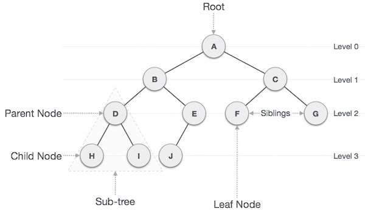
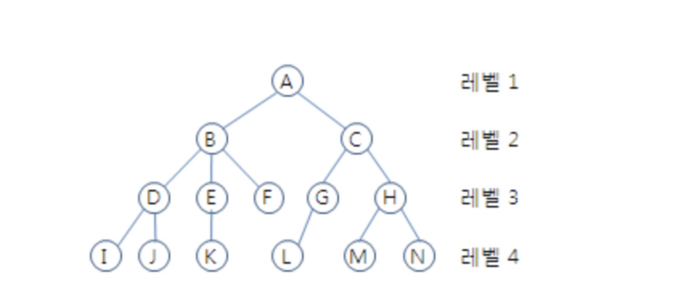
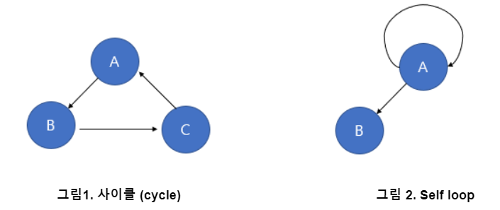

# Tree(트리)

## 1. Tree 개념

노드로 이루어진 **비선형 계층적 자료구조** 

트리 내에 또다른 트리가 있는 **재귀적 자료구조**

## 2. 용어

- 노드(node) : 트리를 구성하는 하나의 요소를 노드라고 부르며 하나의 노드가 지정하는 값을 키라고 한다.
- **루트 노드**(root node) : 부모가 없는 노드. 트리는 하나의 루트 노드만을 가진다.
- **단말 노드**(leaf node) : 자식이 없는 노드이다.
- **내부(internal) 노드** : 리프 노드가 아닌 노드.
- **형제 노드**(sibling node) : 같은 부모를 가지는 노드.
- 엣지**(edge)** : 노드를 연결하는 선 (link, branch 라고도 부름).

- **크기**(size) : 자신을 포함한 모든 자손 노드의 개수.
    - C의 크기 : 6
    
- **깊이**(depth) : 루트에서 어떤 노드에 도달하기 위해 거쳐야 하는 간선의 수
    - D의 깊이 : 2
    - L의 깊이 : 3
    
- **레벨**(level) : 트리의 특정 깊이를 가지는 노드의 집합
    - A의 레벨 : 1
    - B, C의 레벨 : 2
    - D, E, F, G, H의 레벨 : 3
    
- **차수**(degree) :  각 노드가 지닌 가지의 수
    - A의 차수 = 2
    - B의 차수 = 3
    - C의 차수 = 2
    
- 트리의 **차수**(degree of tree) : 트리의 최대 차수
    - B가 최대 차수를 가짐 => 3
    
- 트리의 **높이**(height) : 루트 노드에서 가장 깊숙히 있는 노드의 깊이
    - 3

## 2. Tree 특징

트리는 **노드**와 **간선**으로 이루어진 계층적 관계를 표현하는 자료구조로 스택이나 큐와 같은 선형 구조가 아닌 비선형 자료구조이다.

- 노드가 `N`개인 트리는 항상 `N-1`개의 링크(link)를 가진다
- 추가로, 트리에는 **사이클(Cycle)**이 존재할 수 없다.

사이클이란, 루트에서 어떤 노드로 가는 경로는 유일하다 것을 뜻한다. 따라서, 트리는 사이클이 없는 하나의 **연결 그래프(Connected Graph)**라고 할 수 있다. 당연하게 트리의 노드는 **self-loop**이 있어서는 안 된다. 즉, 노드 자기 자신과 연결된 간선이 존재해서는 안 된다.

이제부터 트리 유사한 그림들을 보면서 트리가 맞는지 아닌지를 살펴보자.

                                       트리1

트리 1은 트리가 아니다. 사이클이 있기 때문이다. (D에서 시작해 B, C, E를 거치면 다시 D로 올 수 있기 때문)

트리2

트리 2도 트리가 아니다. 사이클은 없지만 1에서 4로 가는 경로가 유일하지 않기 때문이다. (즉, 1 → 2 → 4로도 4로 가고 1 → 3 → 4를 통해서도 4로 갈 수 있기 때문에 트리가 아니다.)

트리 3

트리 3도 트리가 아니다. (모든 노드들이 연결되어 있는 상태가 아니기 때문)

## 3. 트리의 종류

트리의 종류에는 트리, 이진 트리, 완전 이진트리, 균형 이진트리, 포화 이진트리, 균형 트리, 편향 이진 트리 등으로 되어 있다.

| 이진 트리(Binary Tree) | 각 노드가 최대 두 개의 자식을 갖는 트리이다. 모든 트리가 이진 트리는 아니다.
이진 트리의 순회는 중위 순회(left -> 현재 -> right), 전위 순회(현재 -> left -> right), 후위 순회(left -> right -> 현재)가 있다.
이진 탐색 트리는, 모든 노드가 모든 왼쪽 자식들 <= n <= 모든 오른쪽 자식들의 특정 순서를 따르는 이진 트리이다. |
| --- | --- |
| 완전 이진트리(Complete BT) | 마지막 레벨을 제외하고 모든 레벨이 완전히 채워져 있는 트리이다. |
| 균형 이진트리(Full Binary Tree) | 모든 노드가 0개 또는 2개의 자식 노드를 갖는 트리이다. |
| 포화 이진트리(Perfect Binary Tree) | 균형 이진트리이면서 완전 이진트리로, 모든 단말노드는 같은 높이에 있어야 하며, 모든 내부 노드가 두 개의 자식노드를 갖는다. |
| 균형 트리(B-Tree) | 레드블랙트리, AVL트리가 이 일종이며, 시간 복잡도 O(logN)에 삽입, 찾기 등을 무리없이 가능한 균형 잡힌 트리이다. |
| 편향 이진 트리(Skewed Binary Tree) | 편향 이진 트리는 하나의 차수로만 이루어져 있는 경우를 의미한다. 이러한 구조는 배열(리스트)와 같은 선형 구조이므로 'Leaf Node'(가장 아래쪽에 위치한 노드) 탐색 시 모두 데이터를 전부 탐색해야 한다는 단점이 있어 효율적이지 못하다. (이를 보완하기 위해 높이 균형 트리라는 것이 있다.) |
|  |  |

## 4. 트리 순회 **(Tree Traversal)**

트리의 모든 노드들을 방문하는 과정을 트리 순회라고 한다. 트리 구조에서 노드를 순차적으로 조회할 때의 순서는 **항상 왼쪽부터 오른쪽**이다.

### 4-1. **전위 순회(Preorder Traversal)**

- 부모 노드를 먼저 방문하는 순회 방식
- 우선순위 : 부모 → 왼 → 오

깊이 우선 순회(DFT, Depth-First Traversal)이라고도 하며, 트리를 복사하거나, 전위 표기법을 구하는데 주로 사용된다. 트리를 복사할 때 전위 순회를 사용하는 이유는 트리를 생성할 때 자식 노드보다 부모 노드가 먼저 생성되어야 하기 때문이다.

[https://img1.daumcdn.net/thumb/R1280x0/?scode=mtistory2&fname=https%3A%2F%2Fblog.kakaocdn.net%2Fdn%2FqaUdk%2Fbtq16y96ZK5%2FHzgM9ijvptwnj6jxshGYbK%2Fimg.png](https://img1.daumcdn.net/thumb/R1280x0/?scode=mtistory2&fname=https%3A%2F%2Fblog.kakaocdn.net%2Fdn%2FqaUdk%2Fbtq16y96ZK5%2FHzgM9ijvptwnj6jxshGYbK%2Fimg.png)

위 트리의 전위 순회 결과 : A->B->D->E->C->F->G

### 4-2. **중위 순회(Inorder Traversal)**

- 왼쪽 노드를 먼저 방문 후 부모노드를 방문하는 순회 방식
- 우선순위: 왼 → 부모 → 오

 대칭 순회(Symmetric Traversal)라고도 하며 중위 순회는 이진 탐색 트리(BST, Binary Search Tree)에서 오름차순 또는 내림차순으로 값을 가져올 때 사용한다. 내림차순으로 값을 가져오기 위해서는 역순(오른쪽-> root-> 왼쪽)으로 중위 순회를 하면 된다.

[https://img1.daumcdn.net/thumb/R1280x0/?scode=mtistory2&fname=https%3A%2F%2Fblog.kakaocdn.net%2Fdn%2FmJf2v%2Fbtq18DJBGdX%2FGX3tikbiJVXxMPVVYb82a1%2Fimg.png](https://img1.daumcdn.net/thumb/R1280x0/?scode=mtistory2&fname=https%3A%2F%2Fblog.kakaocdn.net%2Fdn%2FmJf2v%2Fbtq18DJBGdX%2FGX3tikbiJVXxMPVVYb82a1%2Fimg.png)

위 트리의 중위 순회 결과 : D->B->E->A->F->C->G

### 4-3. **후위 순회(Postorder Traversal)**

- 하위노드를 먼저 방문 후 부모 노드를 방문하는 순회 방식
- 우선순위: 왼 → 오 → 부모

후위 순회는 주로 트리를 삭제하는 데 사용된다. 부모 노드를 삭제하기 전에 자식 노드를 삭제하는 순으로 노드를 삭제해야 하기 때문이다.

[https://img1.daumcdn.net/thumb/R1280x0/?scode=mtistory2&fname=https%3A%2F%2Fblog.kakaocdn.net%2Fdn%2Fcj9NLm%2Fbtq18oMo4Wg%2FkmRXeo7LyIbUuwkWesmg1k%2Fimg.png](https://img1.daumcdn.net/thumb/R1280x0/?scode=mtistory2&fname=https%3A%2F%2Fblog.kakaocdn.net%2Fdn%2Fcj9NLm%2Fbtq18oMo4Wg%2FkmRXeo7LyIbUuwkWesmg1k%2Fimg.png)

위 트리의 후위 순회 결과 : D->E->B->F->G->C->A

전위 순회: 부모 → 왼 → 오

중위 순회: 왼 → 부모 → 오

후위 순회: 왼 → 오 → 부모