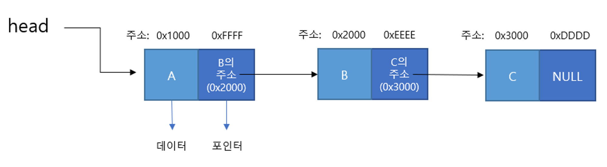
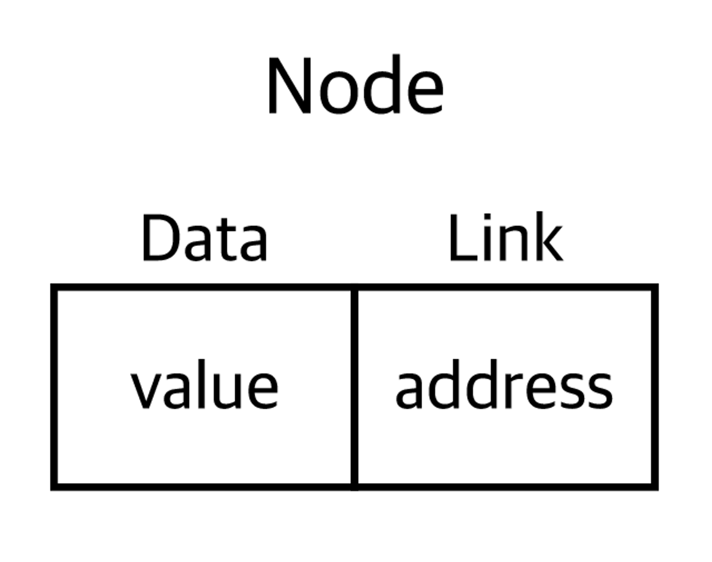
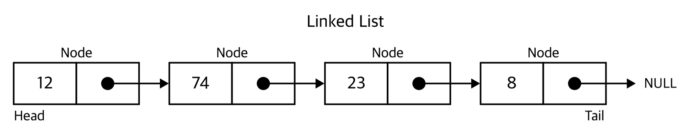
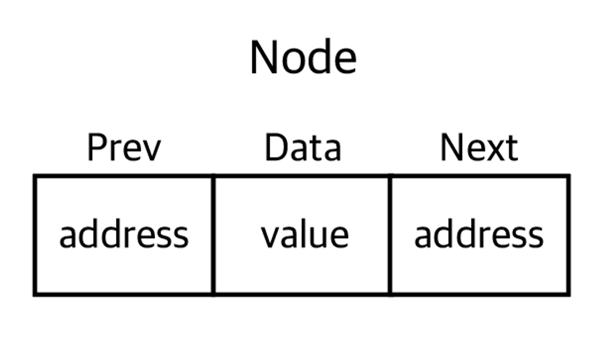
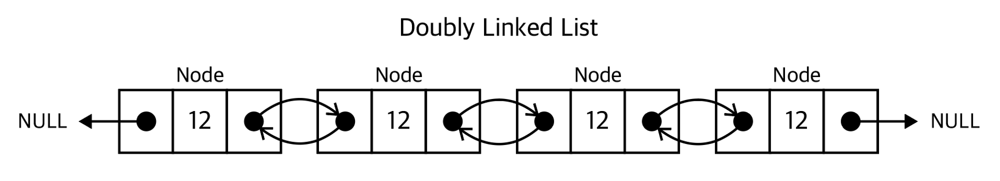
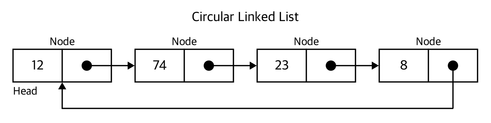
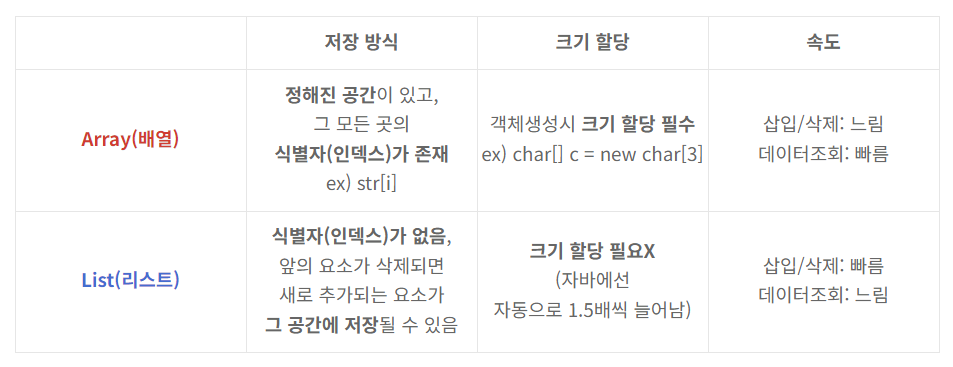

## **Linked List (연결 리스트)**

### 특징

각 노드가 데이터와 포인터를 가지고 한 줄로 연결되어 있는 방식으로 데이터를 저장한다.

각 노드는 다음 노드를 가리키는 포인터를 포함하고, 그 포인터는 다음 노드의 주소를 값으로 가지고 있다.

### 종류

- **단순 연결 리스트(Singly linked list)**

각 노드에 자료 공간과 한 개의 포인터 공간이 있고, 각 노드의 포인터는 다음 노드를 가리킨다.

- **이중 연결 리스트(Doubly linked list)**

단순 연결 리스트는 현재 노드에서 다음 노드로 갈 수 있지만 이전 노드로는 갈 수 없다. 이러한 단점을 해결하기 위해 노드에 앞 노드의 메모리 주소를 보관하는 포인터 prev를 만들어준 형태를 이중 연결 리스트(Doubly Linked List) 라고 한다.

- **원형 연결 리스트(Circular linked list)**

원형 연결 리스트(Circle linked List)란 단순 연결 리스트(Singly Linked List)의 마지막 노드의 포인터가 NULL이 아닌 헤드를 가리키는 형태의 리스트이다.

### 시간 복잡도

**1. 접근**  O(n)

인덱스 x에 있는 노드에 접근하려면 Head에서 다음 노드로 x번 가면 된다.

**2. 탐색** O(n)

배열을 탐색할 때와 같은 방법으로 구한다.

가장 앞 노드부터 다음 노드를 하나씩 보면서 원하는 데이터를 갖는 데이터를 찾는다. 

찾는 데이터가 없거나 또는 찾으려는 데이터가 마지막 노드에 있는 경우 n개의 노드를 다 봐야 한다.

**3. 삽입, 삭제** O(1) ~ O(n) 

삽입, 삭제할 노드를 탐색하는 과정이 필요하기 때문에 최악의 경우 O(n)의 시간 복잡도가 필요하다. 하지만 연결 리스트의 맨 앞에 삽입하는 경우는 이미 Head를 알고 있기 때문에 O(1)의 시간 복잡도를 가진다. 또한 Tail을 알고 있다면, 맨 뒤에 삽입하는 경우 O(1)의 시간 복잡도를 가진다.

### Array vs Linked List

- 배열은 사용하기 전 배열의 크기를 미리 선언해야 하고, 크기의 수정이 불가능하기 때문에 메모리 사용이 비효율적이다. (정적 할당)
- 연결 리스트는 필요할 때마다 노드를 생성하여 연결하면 되기 때문에 메모리를 효율적으로 사용할 수 있다. (동적 할당)
- 배열은 메모리 공간에 연속적으로 저장되어 있는 자료구조이다. 이러한 특징때문에 인덱스를 통한 접근이 용이하고, 데이터 외에 다른 정보를 저장할 필요가 없다.
- 연결 리스트는 데이터를 저장할 공간 뿐만 아니라, 다음 노드의 주소를 저장하는 공간이 추가적으로 필요하다.

