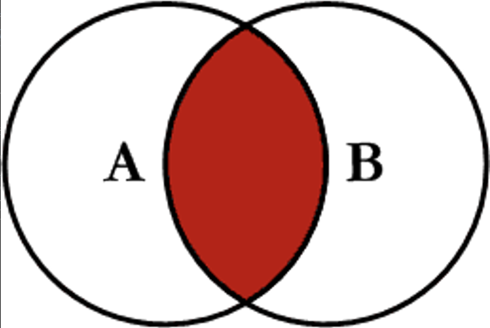
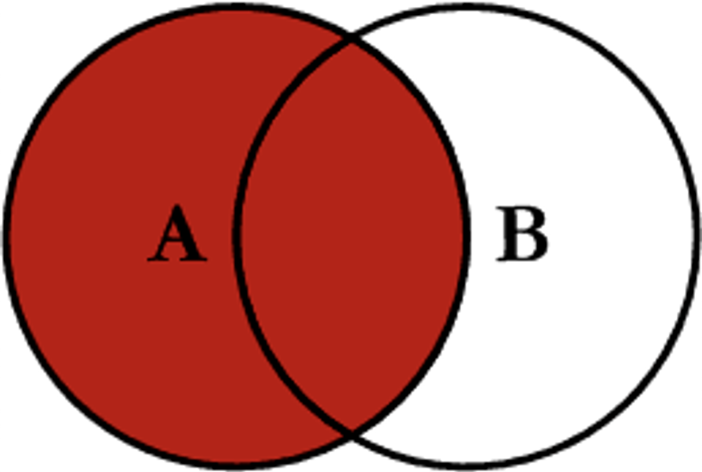
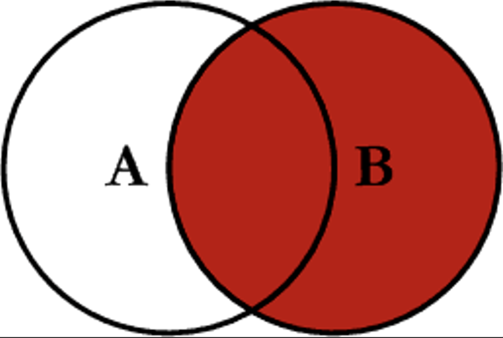
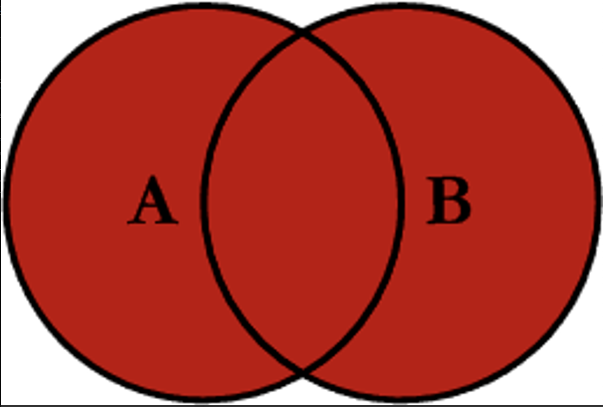
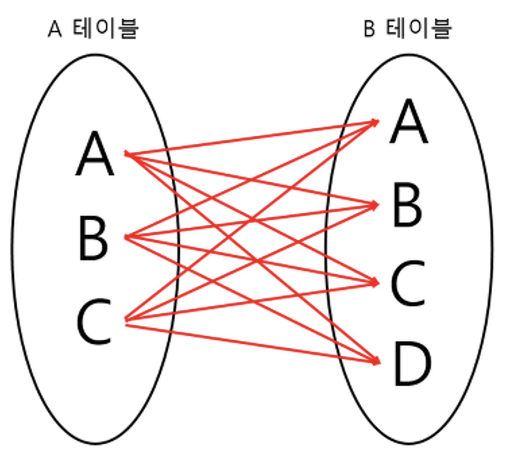
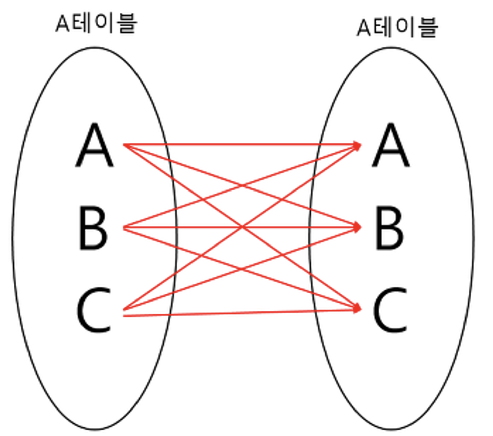

- **하나의 테이블이 아닌 두 개 이상의 테이블을 묶어서 하나의 결과물을 만드는 것**
- JOIN을 사용하는 이유는 **데이터베이스에서 테이블을 분리하여 ‘데이터 중복을 최소화’하고 ‘데이터의 일관성’을 유지하기 위함**이다.
- 대표적으로 **INNER JOIN, OUTER JOIN** 등이 있다.

### **JOIN 종류**

**INNER JOIN**



- **교집합**의 개념이다.
- JOIN의 종류를 별도로 지정해주지 않았을 경우 `INNER JOIN` 방식이 기본적으로 사용된다.
- 기준 테이블과 join 테이블의 **중복된 값**을 보여준다.
- 명시적 조인 표현(explicit)과 암시적 조인 표현(implicit)이 있다.

- 명시적 조인 표현

```
SELECT
A.NAME, B.AGE
FROM EX_TABLE A
INNER JOIN JOIN_TABLE B ON A.NO_EMP = B.NO_EMP;
```

- 암시적 조인 표현

```
SELECT
A.NAME, B.AGE
FROM EX_TABLE A, JOIN_TABLE B
WHERE A.NO_EMP = B.NO_EMP;
```

**LEFT OUTER JOIN**



- **왼쪽 테이블을 기준 테이블로 설정하여 JOIN이 이루어진다.**
- **기준 테이블의 모든 값이 출력되고, 오른쪽인 조인 테이블에만 존재하는 값은 출력되지 않는다.**
- 기준 테이블에는 존재하는데 조인 테이블에는 존재하지 않는 데이터의 경우 조인 테이블의 속성 값이 NULL이 된다.

```
SELECT
A.NAME, B.AGE
FROM EX_TABLE A
LEFT OUTER JOIN JOIN_TABLE B ON A.NO_EMP = B.NO_EMP
```

**RIGHT OUTER JOIN**



- LEFT OUTER JOIN과 동일한 동작을 하며, 오른쪽 테이블을 기준 테이블로 설정하여 JOIN이 이루어진다.

```jsx
SELECT
A.NAME, B.AGE
FROM EX_TABLE A
RIGHT OUTER JOIN JOIN_TABLE B ON A.NO_EMP = B.NO_EMP
```

**FULL OUTER JOIN**



- **합집합**의 개념으로 **왼쪽과 오른쪽 테이블의 모든 데이터가 선택된다.**

```jsx
SELECT
A.NAME, B.AGE
FROM EX_TABLE A
FULL OUTER JOIN JOIN_TABLE B ON A.NO_EMP = B.NO_EMP
```

**CROSS JOIN**

- 두 테이블의 모든 행을 조인시켜 생길 수 있는 **모든 경우의 수**를 표현해주는 방식이다.
- CROSS JOIN의 결과는 **두 테이블의 행의 개수의 곱** 만큼의 데이터를 갖는다.
- 카티션 곱(CARTESIAN PRODUCT)라고도 한다.

> **Table A의 행이 3개, B가 4개이면 총 3*4 = 12개의 데이터가 검색**된다.
> 



```
SELECT
A.NAME, B.AGE
FROM EX_TABLE A
CROSS JOIN JOIN_TABLE B
```

**SELF JOIN**

- 1개의 테이블을 사용하여 **자기자신과 조인**하는 것이다.
- 자신이 갖고 있는 칼럼을 다양하게 변형시켜 활용할 때 자주 사용한다.
- 별도의 SELF JOIN 연산이 있는 것이 아니라, INNER JOIN, OUTER JOIN 등에서 대상이 되는 두 테이블을 자기 자신으로 조인하는 경우 SELF JOIN이 된다.



```
SELECT
A.NAME, B.AGE
FROM EX_TABLE A, EX_TABLE B
```

### 사용 예시

**학생 테이블에 (학교, 학년, 나이) 칼럼이 존재**하고, 같은 학교 같은 학년에 다니는 학생들의 나이를 비교하고 싶은 경우, **학교와 학년을 기준으로 SELF JOIN**을 이용한다.

### **조인의 원리**

**중첩 루프 조인**

- 중첩 for문과 같은 원리로 조건에 맞는 조인을 하는 방법
- 예를 들어, ‘t1, t2 테이브를 조인한다’라고 했을 때 첫번째 테이블에서 행을 한번에 하나씩 읽고 그 다음 테이블에서도 행을 하나씩 읽어 조건에 맞는 레코드를 찾아 결과값을 반환

**정렬 병합 조인**

- 각각의 테이블을 조인한 필드 기준으로 정렬하고 정렬이 끝난 이후에 조인 작업을 수행하는 조인

**해시 조인**

- 해시 테이블을 기반으로 조인하는 방법
- 해시 조인 단계
    - 빌드 단계 : 입력 테이블 중 하나를 기반으로 메모리 내 해시 테이블을 빌드하는 단계 
    - 프로브 단계 : 레코드를 읽기 시작하며, 각 레코드에서 일치하는 레코드를 찾아서 결과값으로 반환
