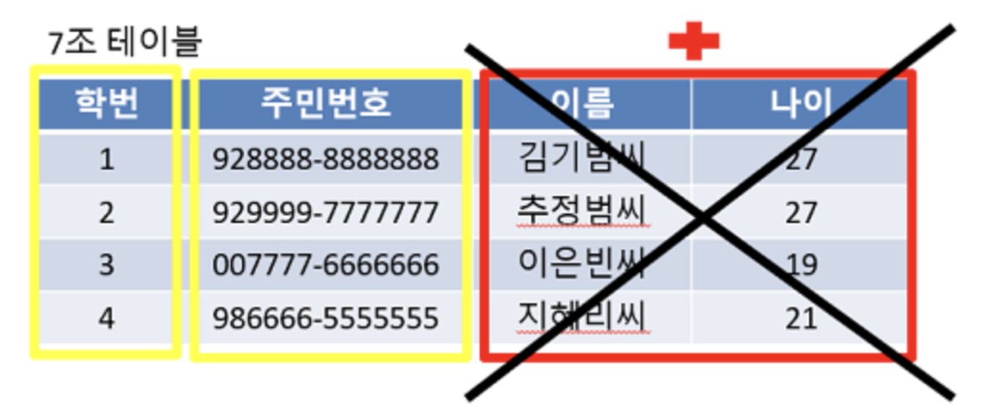
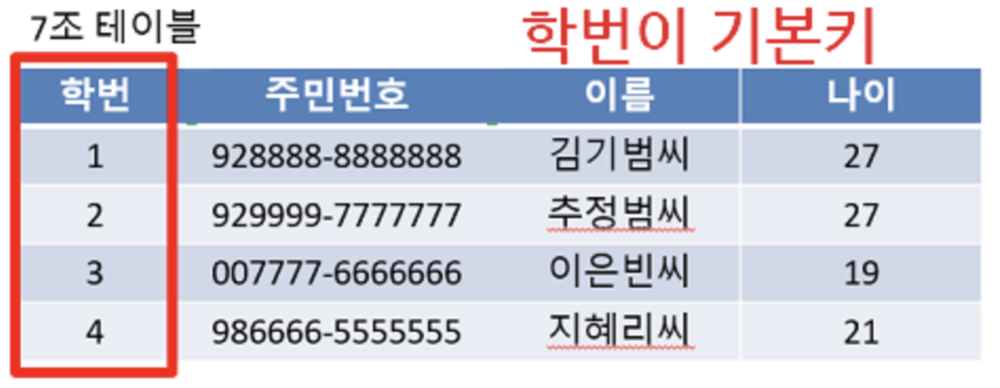
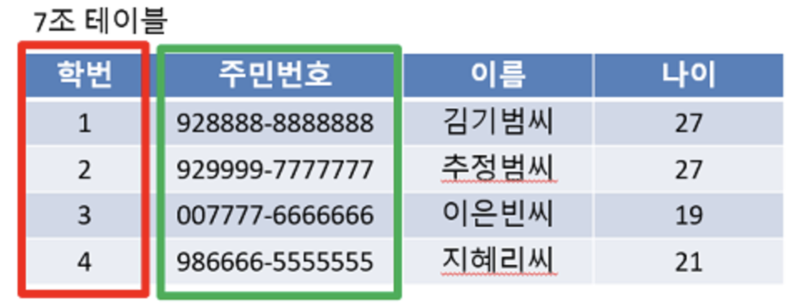
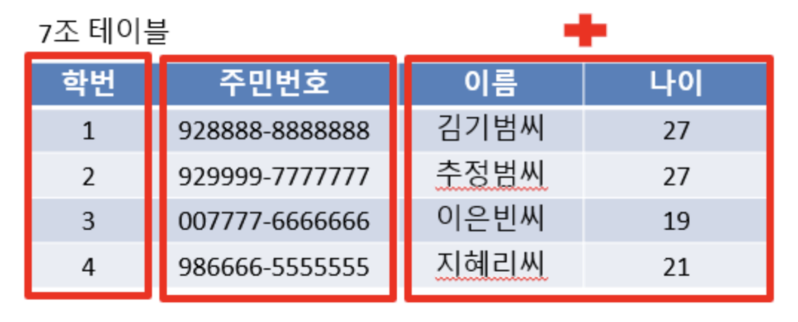
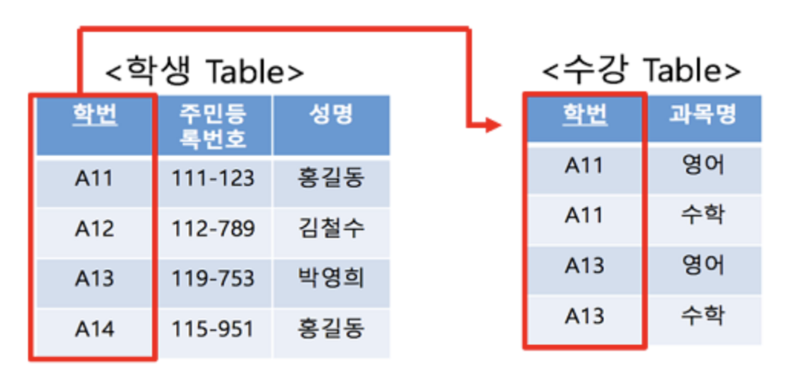

## 키

- 테이블 간의 관계를 조금 더 명확하게 하고 테이블 자체의 인덱스를 위해 설정된 장치

- **슈퍼키**는 유일성이 있고 그 안에 포함된 **후보키**는 최소성까지 갖춘 키

- 후보키 중에서 **기본키**로 선택되지 못한 키는 **대체키**가 된다

### **1. Candidate Key (후보키)**

- 테이블에서 각 행을 유일하게 식별할 수 있는 **최소한**의 속성들의 집합으로 기본키가 될 수 있는 후보들이다.
- **유일성과 최소성**을 동시에 만족해야한다.
- **슈퍼키들 중에서 속성의 수가 최소가 되는 슈퍼키**가 후보키가 된다.

> 최소성 : 키를 구성하는 속성들 중 가장 최소로 필요한 속성들로만 키를 구성하는 성질을 말한다.

### **2. Primary Key (기본키)**

- **후보키들 중에서 하나를 선택한 키**로 유일성과 최소성을 만족하는 속성이다.
- 테이블에서 기본키는 **오직 1개만** 지정할 수 있다.
- 기본키는 **테이블 안에서 유일하게 각 행들을 구별**할 수 있도록 쓰인다.
- 기본키는 **NULL** 값을 절대 가질수 없고, 중복된 값을 가질 수 없다.
- 각 행들을 구별하려면 값이 없어선 안되고, 중복 되어서도 안되기 때문이다.

> **이름 + 나이 슈퍼키는 속성의 개수가 다른 것보다 많기 때문에 최소성을 만족하지 못해서 후보키가 될 수 없다.**
>

### **3. Alternate Key (대체키)**

- **후보키가 두 개 이상일 경우 그 중에서 하나를 기본키로 지정하고 남은 후보키들을 대체키**라고 한다.
- 따라서 대체키는 **기본키로 선정되지 않은 후보키**이다.

> **학번이 기본키가 되고, 남은 후보키인 주민번호는 대체키**가 된다. 만약 학번 기본키가 없어지게 되면 주민번호는 없어진 기본키를 대체할 수 있게된다.
> 

### **4. Super Key (슈퍼키)**

- **테이블에서 각 행을 유일하게 식별할 수 있는 하나 또는 그 이상의 속성들의 집합**이다.
- **유일성만 만족하면 슈퍼키가 될 수 있다.**

> 유일성 : **하나의 키로 특정 행을 바로 찾아낼수 있는 고유한 데이터 속성**을 말한다. 예를 들어 전국에서 나를 구별할 수 있는 유일하고 고유한 속성은 **주민번호**이다. 주민번호는 전국민이 모두 겹치지 않아 유일하고 고유한 구별 방법으로 쓰인다.
> 

### **5. Foreign Key (외래키)**

**외래키**가 있어야, **관계형 데이터베이스**인 것~!

- **테이블이 다른 테이블의 데이터를 참조하여, 테이블간의 관계를 연결**하는 것이다.
- 다른 테이블의 데이터를 참조할 때 없는 값을 참조할 수 없도록 제약을 주는 것이다.
- 예를 들어 참조 될 테이블(A)이 먼저 만들어지고 참조하는 테이블(B)에 값이 입력되어야 한다.
- 이때, B에 입력된 A의 값은 A에서의 기본키(Primary Key)로 설정되어 있어야한다.
- 외래키는 **참조되는 테이블의 기본키와 동일한 키 속성을 가진다.**
- 참조되는 부모 테이블이 먼저 생성된 뒤 데이터를 넣고, 참조하는 자식 테이블이 다음에 생겨야 한다.
- 따라서 부모 테이블은 먼저 삭제될 수 없다.
    - 부모테이블을 참조하는데 부모테이블이 삭제되면 자식테이블은 참조하는 것이 없어지기 때문에 외래키 오류가 생긴다.
- 외래키 관계에서 부모테이블을 삭제하려면 자식테이블 먼저 삭제한 후 부모테이블을 삭제 해야한다.

> **부모 테이블은 학생 테이블**, **자식 테이블은 수강 테이블**일 때, **학생테이블은 학번이 기본키이자 참조되는 참조키**이다. 반면 **수강테이블은 학번이 참조하는 키이자 외래키**이다.
>