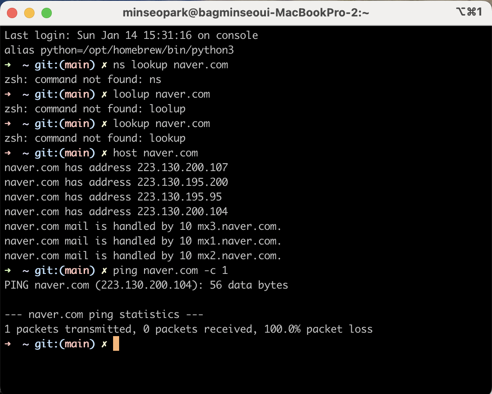
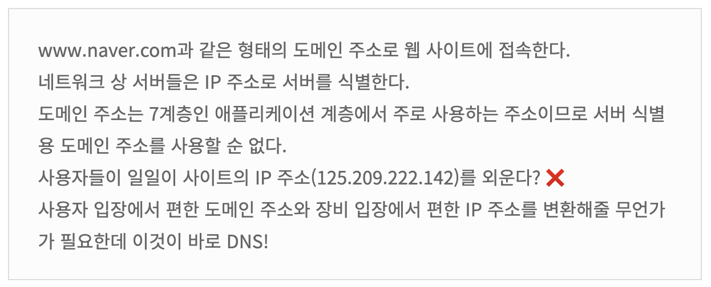
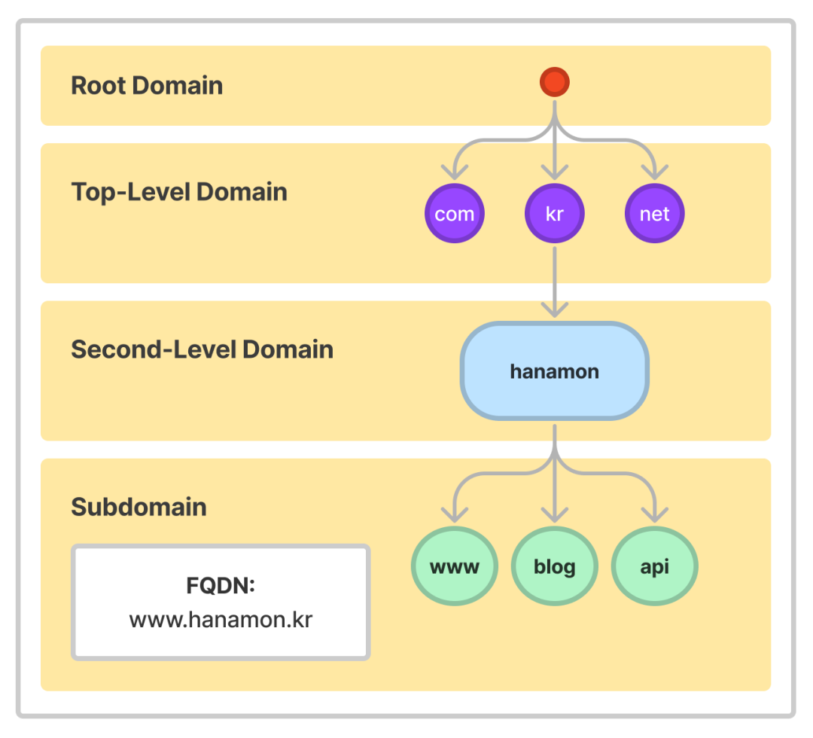
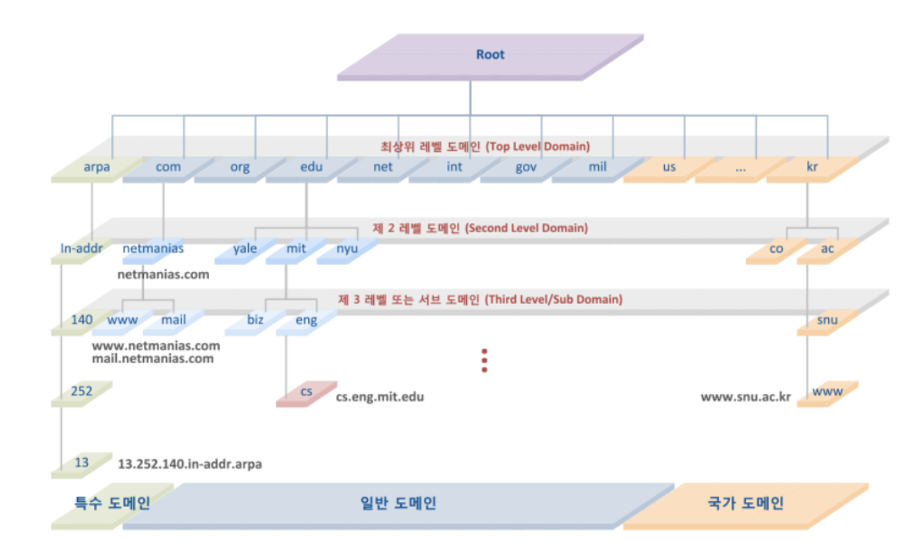
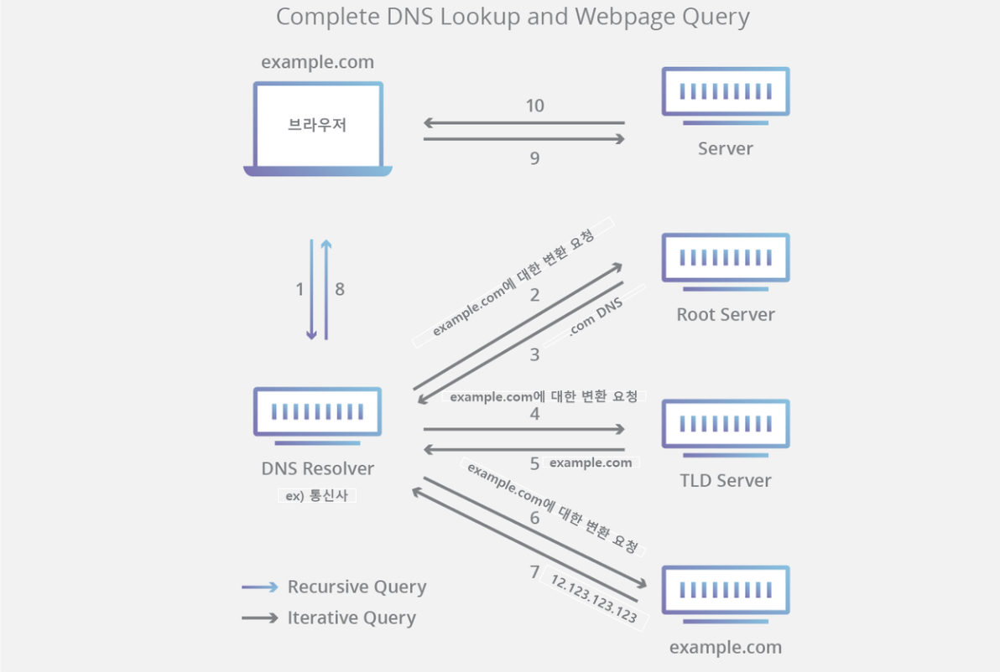
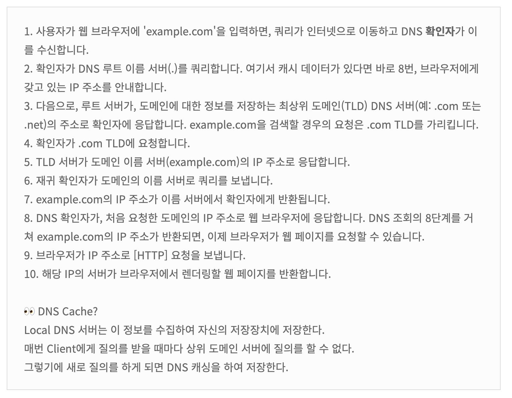

# DNS

# 1. Domain 이란?

도메인은 웹 브라우저를 통해 특정 사이트에 진입을 할 때, **IP 주소를 대신하여 사용하는 주소**이다.

도메인을 이용해서 **한눈에 파악하기 힘든 IP 주소를 보다 분명하게** 나타낼 수 있다.

만약 IP 주소가 지번 또는 도로명 주소라면, 도메인 이름은 해당 주소에 위치한 상호로 볼 수 있다.

도로명 주소를 대신해서, 우리는 상호나 건물의 이름을 찾아 갈 수도 있는 것처럼 말이다**.**

### ✅ 맥에서 도메인 IP 확인

```java
host naver.com
```



### ✅ 윈도우에서 도메인 IP 확인

```java
nslookup naver.com
```

# 2. DNS (Domain Name System)이란?

- 계층 구조를 지원하는 도메인 기반의 주소 표기 방법을 위한 분산 데이터 베이스 시스템
- 도메인 이름에서 IP 주소를 얻는 것



---

# 3. **DNS 구성 요소**

우선 “이 도메인 이름은 이 IP 주소이다”라는 **‘텍스트’를 저장하는 데이터베이스가 필요**하다. 그리고 **분산된 데이터가 어디 저장되어 있는지 찾을 프로그램**들이 필요하고 찾았으면 **해당 IP 주소로 이동할 프로그램(브라우저 등)**이 필요하다.

DNS는 아래 세가지 요소로 구성되어있다.

1. **도메인 네임 스페이스(Domain Name Space)**
    - 트리 구조의 네임 스페이스를 비롯해 데이터에 대한 이름 관련 규칙을 정의
    - 도메인 주소를 어떻게 관리할 지에 대한 방법
    - 트리에 연결된 호스트는 자원 레코드로 표현됨
    - DNS 서비스는 자원 레코드의 특정 유형 정보를 얻는 과정

1. **네임 서버(Name Server) = 권한 있는 DNS 서버**
    - 도메인 트릭 구조와 트리에 보관딘 자원 레코드를 관리하는 프로그램
    - 도메인 주소를 관리하기 위해 사용하는 DNS 전용 서버
    - 보통 도메인 주소의 일부만을 가진 분산 형태임
    
2. **리졸버(Resolver) = 권한 없는 DNS 서버**
    - DNS 상의 클라이언트
    - 네임서버로 부터 클라이언트의 요청 정보를 얻어내는 프로그램
    - 하나 이상의 네임 서버와 접촉
    

---

# 4. **DNS 구성 요소**

## 4-1. **도메인 네임 스페이스(Domain Name Space)**



DNS는 전세계적인 거대한 분산 시스템이다.도메인 네임 스페이스는 이러한 DNS가 저장 관리하는 계층적 구조를 의미한다.도메인 네임 스페이스는 최상위에 루트 DNS 서버가 존재하고 그 하위로 연결된 모든 노드가 연속해서 이어진 계층 구조로 되어있다.

### **계층적 도메인 레벨 (Hierarchical Domain Level)**

1. **도메인 네임 스페이스의 계층 구조**:
    - 도메인 네임 스페이스는 최상위 레벨(Top-Level Domain, TLD)부터 시작해 계층적으로 구성된다.
    - 예를 들어, "naver.com"에서 "com"은 TLD이고, "naver"는 그 아래 두 번째 레벨의 도메인이다.
2. **도메인 관리의 위임**:
    - "naver.com"은 "com" 도메인을 관리하는 네임 서버에 등록되어 있다.
    - 하위 도메인 예시로 "blog.naver.com"을 생성하려면, "naver.com" 도메인을 관리하는 네임 서버의 레코드를 수정하여 "blog"라는 하위 도메인을 추가한다.
3. **호스팅 서비스와의 연동**:
    - 만약 "naver.com" 도메인을 AWS 호스팅 서비스와 연결하려면, AWS의 Route 53에서 생성된 네임 서버를 "naver.com" 도메인의 레코드에 추가해야 한다.
    - 이렇게 설정하면, "naver.com"에 대한 DNS 쿼리는 AWS의 Route 53 네임 서버에서 처리되어, 해당 웹사이트가 호스팅되는 인스턴스나 버킷으로 연결된다.
    - 비슷한 방식으로, 다른 호스팅 서비스(예: 카페24)를 사용할 경우, 해당 서비스의 네임 서버를 "naver.com" 도메인에 추가하고, 카페24에서도 도메인을 연결한다.
    

이 과정은 도메인 네임 스페이스의 계층적 구조를 통해 효율적으로 도메인을 관리하고, 웹사이트 호스팅 서비스와의 연결을 가능하게 한다. DNS 시스템의 이러한 구조 덕분에 웹사이트 관리자는 도메인을 쉽게 관리하고, 필요에 따라 다른 호스팅 서비스로 전환할 수 있다.

### **Fully Qualified Domain Name(FQDN) 전체 도메인 이름**

도메인의 전체 이름을 표기하는 방식을 말한다.

일반적으로 도메인 이름은 www.minseo.kr에서 minseo.kr을 의미하기 때문에 이러한 용어가 나왔다고 본다.

도메인 이름: [minseo.kr](http://minseo.kr) 호스트 이름: www.minseo.kr

## 4-2. **DNS 구성 요소 : 네임 서버(Name Server = DNS Server)**



- 루트 도메인 (Root Domain)
    - 네임 스페이스에서 이름 해석의 출발지 역할을 수행하는 노드 (서버)
    - 최상위 도메인 서버의 정보를 가지고 있음
    - 전세계에 13개의 원본 루트 서버가 존재

- 최상위 도메인 (Top Level Domain = TLD)
    - 국가 코드 최상위 도메인 (ccTLD: country code TLD)
        - .kr, .jp 등
    - 일반 최상위 도메인 (gTLD= global TLD)
        - .net, .com, org 등
    - ARPA(Address and Rounting Parameter Area): 역방향 조회시 사용되는 최상위 도메인
        - in-addr.arpa
        
- 2차 도메인
    - TLD 하위에서 관리되는 서브 도메인
    - 국가 도메인 하위에 기관 유형에 따른 분류
        - .co(일반회사),ac(교육기관),go(정부기관)
        
- 서브 도메인 (Sub Domain)
    - 상위 도메인에 소속되는 각 기관 또는 회사별 도메인
        - google, naver 등

## 4-3. **DNS 구성요소 : 리졸버(Resolver)**

리졸버는 웹 브라우저와 같은 DNS 클라이언트의 요청을 네임 서버로 전달하고 네임 서버로부터 정보(도메인 이름과 IP 주소)를 받아 클라이언트에게 제공하는 기능을 수행한다.

이 과정에서 리졸버는 하나의 네임 서버에게 DNS 요청을 전달하고 해당 서버에 정보가 없으면 다른 네임 서버에게 요청을 보내 정보를 받아온다.

이렇듯 리졸버는 수많은 네임서버에 접근하여 사용자로부터 요청 받은 도메인의 IP 정보를 조회하는 기능을 수행한다.

하지만 리졸버에 기능을 단말에 구현하는 것은 자원의 한계가 있기에 대부분 기능을 DNS 서버에 구현하고 클라이언트 호스트는 리졸버의 단순한 기능만을 지닌 리졸버 루틴을 구현하는 옵션이 제시되어있다.

이러한 단순화된 기능의 리졸버를 스터브 리졸버(Stub Resolver)라고 하며,스터브 리졸버는 수 많은 네임 서버의 구조를 파악할 필요없이 리졸버가 구현된 DNS 서버의 IP 주소만 파악하면 된다.

클라이언트 호스트에서 설정하는 DNS 서버(Recursive DNS Server)는 이와 같은 서버를 의미하는 것으로,도메인에 대한 질의를 받은 스터브 리졸버는 설정된 DNS 서버로 DNS Query(질의)를 전달하고DNS 서버로부터 최종 결과를 응답 받아 웹 브라우저로 전달하는 인터페이스 기능만을 수행한다.

---

# 5. DNS 조회 단계





**DNS 확인자**


- DNS 조회의 첫 번째 중단점
- 최초 요청을 한 클라이언트 처리를 담당함
- URL이 궁극적으로 IP 주소로 변환되도록 하는 일련의 쿼리 시작

---

# 6. **DNS 쿼리 유형**


### **DNS Query(쿼리)란?**

DNS 클라이언트와 DNS 서버는 DNS 쿼리를 교환한다.DNS 쿼리는 Recursive(재귀적) 또는 Iterative(반복적)으로 구분된다.단순한 개념으로 아래와 같은 방식으로 요청과 응답을 한다고 이해하시면 된다.

### **Recursive Query (재귀적 질의)**

결과물(IP 주소)를 돌려주는 작업이다. (결과적으로 Recursive 서버가 Recursive 쿼리를 웹 브라우저 등에게 돌려주는 역할을 한다.)  재귀적 요청을 받은 네임 서버가 결과적으로 해석기 역할을 수행한다. 

### **Iterative Query (반복적 질의)**

Recursive DNS 서버가 다른 DNS 서버에게 쿼리를 보내어 응답을 요청하는 작업이다.Recursive 서버가 권한 있는 네임 서버들에게 반복적으로 쿼리를 보내서 결과물(IP 주소)를 알아낸다.Recursive 서버에 이미 IP 주소가 캐시 되어있다면 이 과정은 건너 뛴다.

### **DNS 동작 과정 전체 예시**

웹 브라우저에 www.hanamon.kr을 입력한다.웹 브라우저는 이전에 방문한적 있는지 찾는다.
    ◦ 브라우저 캐시 확인
    ◦ OS 캐시 확인
    ◦ 라우터 캐시 확인
    ◦ ISP 캐시 확인 (Recursive DNS Server)ISP에서 DNS Iterative하게 쿼리를 날린다. ISP는 Authoritative DNS 서버에서 최종적으로 IP 주소를 응답받는다.ISP는 해당 IP 주소를 캐시한다.웹 브라우저에게 응답한다