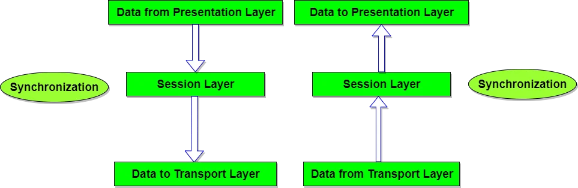
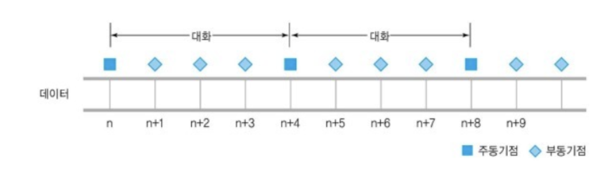

# Layer 5 - session layer (세션 계층)

# 1. 세션 계층

- 응용 프로그램 간의 **대화를 유지**하기 위한 구조 제공 + 이를 처리하기 위해 **프로세스들의 논리적 연결**을 담당
- 통신 중 **연결이 끊어지지 않도록** 유지시켜주는 역할을 수행
    - **TCP/IP 세션의 연결 확립/중단/해제**, 세션 메세지 전송 기능 수행
- **포트 번호를 기반으로 연결**
- 송수신을 위한 **프로세서들을 서로 논리적으로 연결**
- 통신 장치 간 **상호작용 + 동기화**를 제공
- 세션을 종료할 필요가 있을 경우, 적절한 시간을 수신측에게 알려준다.
- Data 단위: **Message**
- **토큰**: **두 프로세스 간의 대화를 관리**하는 특수 메세지
- 대표적 프로토콜: SSH, TLS
- **전이중 통신 / 반이중 통신/ 단방향 통신**이 존재한다.

# 2. 주요기능

## 2-1. 동기 기능

- **통신 양단(프로세서)**끼리 서로 동의 하는 *논리적 동기점을 생성*
    - 메세지가 제대로 처리되고 있는지를 파악
- **동기점**: **오류 복구**를 위해서 필수적으로 사용
    - 동기점 이전은 이미 처리가 된 상태: 복구가 필요 없다.
    - 동기점 이후부터 복구 절차기 진행
- **재동기:** 전송 오류가 발생했을 때 **동기점을 사용해서 복구하는 과정**

## 2-2. 대화기능

- Data 전송 과정
- 시간 경과에 따라 순차적으로 동기점을 부여
    - 신뢰성 보장

# 3. 토큰

- 두 응용 프로세스의 대화를 관리하기 위한 특수 메세지
    - **특정서비스 요구 관리**
- **토큰 보유**: 토큰에 부여된 **특정 권리를 배타적으로 소유**

### 데이터 토큰

- **Data를 전송할 권리**를 제공

### 해체 토큰

- 통신 양단 간의 **연결 해체 과정을 제어**

### 동기 토큰

- 세션 연결을 사용하는 과정에서 **동기 처리가 필요한 지점에 사용**

# 4. 동기점 부여

- 큰 파일 전체를 작은 단위로 나눠서 전송
    - 큰 파일을 **전송하는 과정의 중간 중간에 동기점을 부여**
- **주동기 토큰:** 특정 대화 단위를 구분
- **부동기 토큰:** 대화 단위를 세분화 시켜서 구분
- 주동기점: 설정된 곳은 완벽히 처리가 끝났다 → 주동기점 이전의 복구과정은 필요 없다.
- 부동기점: 복구에 필요한 백업 정보가 상대적으로 복구에 필요한 부담은 최소화
    
    
    

### 주동기점

- 설정된 곳은 완벽히 처리가 끝났다는 의미 ****
    - **주동기점 이전의 복구과정은 필요 x**

### 부동기점

- 복구에 필요한 백업 정보가 상대적으로 적어서 복구에 필요한 부담 최소화
    - **오류 복구가 완벽히 이루어지지 않을 수 있다.**
    - 이전 부동기점에서 복구가 불가능 하면 직전 부동기점으로 이동하는 과정을 반복