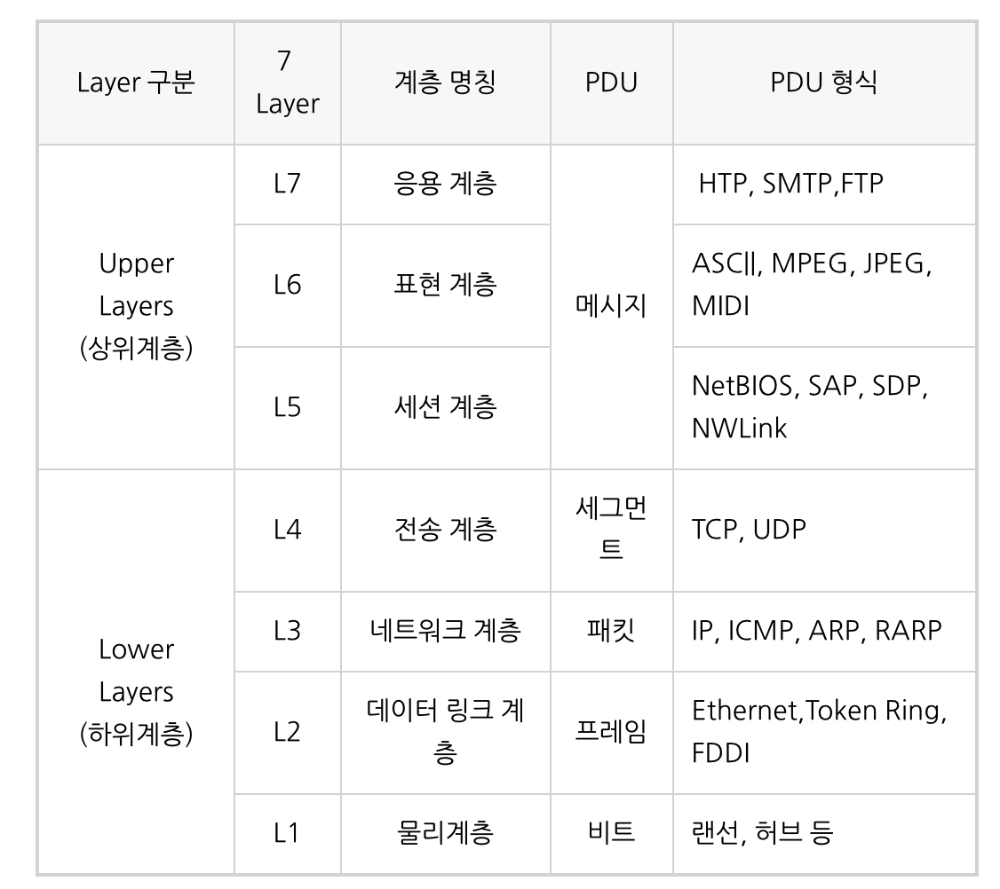
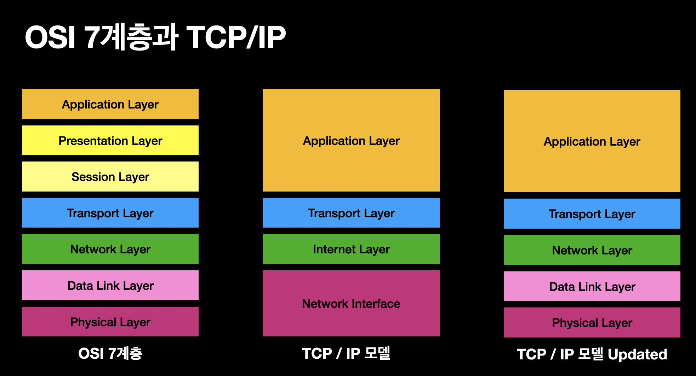
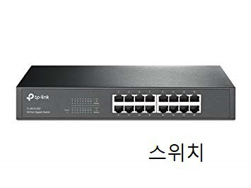
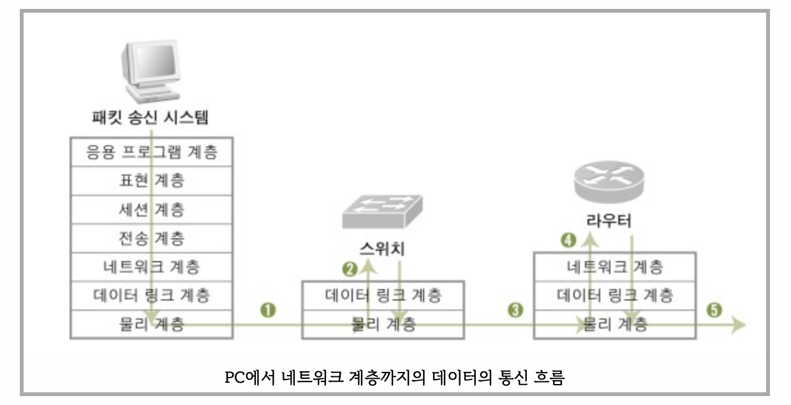

# OSI 7 layers

# 1.OSI 7 계층이란?

Open Systems Interconnection(개방형 시스템 상호연결)의 약자로, **네트워크에서 통신이 일어나는 과정을 7계층으로 나눈 모델**

**계층을 나눈 이유는 통신이 일어나는 과정이 단계별로 파악할 수 있기 때문이다.**

또한 7단계 중 특정한 곳에 이상이 생기면 다른 단계의 장비 및 소프트웨어를 건들이지 않고도 이상이 생긴 단계만 고칠 수 있다.

각 계층별로 소통하는 언어(프로토콜)는 규격화 되어 있고 정의되어 있다. 이를  PDU(Protocol Data Unit)이라 하며 헤더 사이의 정보로써 자리를 잡아 계층 소통간의 메세지 역할을 한다. 

### **하위 계층 (전송/ 네트워크/ 데이터링크/물리)**

- OS 내부에서 구현되어 사용
- 주요기능: Data를 안전하게 전달

### **상위 계층 (응용/ 표현/ 세션)**

- Application을 구현하는데 사용
- Data를 송수신하는 컴퓨터 내의 프로세스 간의 통신 프로토콜

### TCP/IP updated model

OSI 7 Layer 의 목적은 이질적인 시스템간 상호 접속을 위해 공통적인 기반을 제공하는데 있다. 

**하지만 지금은 TCP/IP update 모델이 사용되고 있다.**

TCP/IP updated model 로 대체 되면서 OSI 의 상위 계층(application, presentaion, session)이 application 계층 하나로 통일 되었다.

**[Applicatoin + Presentation + Session] -> [Application]**

# 2. 계층 설명

### 1계층 (Physical Layer)

.png)

이 계층에서는 주로 `전기적 신호`를 이용해 통신 케이블로 데이터를 전송하게 된다.

이 계층에서 사용되는 통신 단위는 `비트`이며 이것은 1과 0으로 나타내어지는, 즉 전기적으로 On, Off 상태를 표현한다.

1계층의 장비로는 `케이블, 리피터, 허브`등이 있다.

즉, 1계층에서는 단지 데이터를 전달만 할 뿐 전송하려는 (또는 받으려는) 데이터가 무엇인지, 어떤 에러가 있는지 등에는 전혀 신경쓰지 않고 단지 데이터 전기적인 신호로 변환해서 주고 받는 기능만 할 뿐이다.

[https://t1.daumcdn.net/cfile/tistory/990DA13D5B73B8C615](https://t1.daumcdn.net/cfile/tistory/990DA13D5B73B8C615)

⇒ **케이블, 리피터, 허브를 통해 데이터 전송한다.**

[https://t1.daumcdn.net/cfile/tistory/9927F73D5B73B8C735](https://t1.daumcdn.net/cfile/tistory/9927F73D5B73B8C735)

### 2계층(Data Link Layer)

2계층을 설명하기에 앞서 각 계층은 독립적이지만, 기본적으로 상하구조 체계이기 때문에

**윗 계층이 동작하기 위해선 아래 계층들이 잘 작동해야 함**을 전제로 한다.

해당 계층은 장치 간 신호를 전달하는 물리계층을 이용하여 네트워크 상의 주변 장치들 간의 데이터를 전송하는 역할을 한다. 

쉽게 말해 물리계층을 통해 송수신되는 정보의 오류와 흐름을 관리하여 안전한 정보의 전달을 수행할 수 있도록 도와주는 역할을 하는 것이다. 

.png)

즉 데이터 링크 계층은 `직접적으로 연결`된 두 개의 노드 사이에 데이터 전송을 가능하게 하고, `Pysical 계층`에서 발생한 오류를 수정하고 재전송하는 기능을 가지고 있다. 

이 계층에서는 맥주소(Mac Address)를 가지고 통신하고, 전송되는 데이터 단위는`프레임`이라 부른다.

대표적인 장비로는 `브리지, 스위치`등이 있다.

- `프레이밍`: Physical Layer를 통해 받은 신호를 조합해 Frame 단위의 데이터 유닛으로 만들어 처리
- `흐름제어`: 데이터를 송수신 시, 너무 많거나 너무 적은 데이터를 송수신하지 않도록 흐름제어
- `오류제어`: 프레임 전송 시 발생한 오류를 복원하거나 재전송
- `접근제어`: 매체 상 통신 주체(장치)가 여러 개 존재할 때, 데이터 전송 여부 결정
- `동기화`: 프레임 구분자 (특별한 bit 패턴)

이처럼 데이터 링크 계층은 단순히 데이터를 마구잡이로 보내지 않고 **안전하게 보내는 역할**도 수행한다.

⇒  **브릿지나 스위치를 통해 맥주소를 가지고 물리계층에서 받은 정보를 전달함, 프레임에 주소부여(MAC - 물리적주소), 에러검출/재전송/흐름제어**

### 3계층 (Network Layer)

> 네트워크 계층은 전송할 데이터를 여러개의 경로를 거쳐 목적지에 전송하는 계층이다.
> 

이 계층에서 가장 중요한 기능은 **데이터를 목적지까지 가장 안전하고 빠르게 전달하는 기능(라우팅)**이다.

여기에 사용되는 프로토콜의 종류도 다양하고, 라우팅하는 기술도 다양하다.

3계층에서 전송단위는 `패킷`이라 부른다.

즉 주소(IP)를 정하고 경로를 선택하고, 패킷을 전달하는 것이 이 계층에서 이루어지고, 이것을 `라우팅`이라 한다.

라우팅은 네트워크에서 `패킷`을 보낼 때 목적지까지 갈 수 있는 여러경로 중 한 경로를 설정해주는 과정이다.

3계층의 장비로는 `라우터, L3 스위치` 등이 있다.

네트워크 계층(Network layer)은 여러개의 노드를 거칠때마다 경로를 찾아주는 역할을 하는 계층으로

다양한 길이의 데이터를 네트워크들을 통해 전달하고, 그 과정에서 전송 계층이 요구하는 서비스 품질(QoS)을 제공하기 위한 기능적, 절차적 수단을 제공한다.

네트워크 계층은 라우팅, 흐름 제어, 세그멘테이션(segmentation/desegmentation), 오류 제어, 인터네트워킹(Internetworking) 등을 수행한다.

라우터가 이 계층에서 동작하고 이 계층에서 동작하는 스위치도 있다.

데이터를 연결하는 다른 네트워크를 통해 전달함으로써 인터넷이 가능하게 만드는 계층이다.

논리적인 주소 구조(IP), 곧 네트워크 관리자가 직접 주소를 할당하는 구조를 가지며, 계층적(hierarchical)이다.

서브네트의 최상위 계층으로 경로를 설정하고, 청구 정보를 관리한다. 개방형 시스템들의 사이에서 네트워크 연결을 설정, 유지, 해제하는 기능을 부여하고, 전송 계층 사이에 네트워크 서비스 데이터 유닛(NSDU : Network Service Data Unit)을 교환하는 기능을 제공한다.

⇒ **주소부여(IP), 경로설정(Route)**

### 4계층 (Transport Layer)

통신을 활성화하기 위한 계층이다. 보통 TCP프로토콜을 이용하며, 포트를 열어서 응용프로그램들이 전송을 할 수 있게 한다.

만약 데이터가 왔다면 4계층에서 해당 데이터를 하나로 합쳐서 5계층에 던져 준다.

단대단 오류제어 및 흐름제어 이 계층 까지는 물리적인 계층에 속한다.(TCP/UDP프로토콜을 사용한다.)

.png)

전송 계층(Transport layer)은 양 끝단(End to end)의 사용자들이 신뢰성있는 데이터를 주고 받을 수 있도록 해 주어, 상위 계층들이 데이터 전달의 유효성이나 효율성을 생각하지 않도록 해준다.

시퀀스 넘버 기반의 오류 제어 방식을 사용한다.

전송 계층은 특정 연결의 유효성을 제어하고, 일부 프로토콜은 상태 개념이 있고(stateful),

**연결 기반(connection oriented)**이다.

이는 **전송 계층이 패킷들의 전송이 유효한지 확인하고 전송 실패한 패킷들을 다시 전송한다는 것**을 뜻한다.

대표적으로 `TCP 프로토콜`과`UDP 프로토콜`이 있다.

`TCP 프로토콜`은 **신뢰성있는 통신을 보장**하고, 신뢰성있는 연결과 전달을 보장하는만큼 계속 연결을 유지해야 해서 그만큼의 리소스가 더 들어간다.

반대로, `UDP 프로토콜`은 **빠른 데이터 전송에 초점**을 뒀다. 목적지에 데이터가 제대로 도착했는지는 상관하지 않는다. 따라서 신뢰성있는 데이터 전송보다 스트리밍과 같은 연속적인 특성을 가진 서비스에 UDP 프로토콜이 적합하다고 할 수 있다.

4 계층의 장비로는 L4 스위치가 있다. L3와의 차이점은 3계층에서 온 트래픽을 분석해 서비스 종류를 구분한다. 

### 5계층 (Session Layer)

**데이터가 통신하기 위한 논리적인 연결**을 말한다. 통신을 하기위한 대문이라고 보면 된다.

하지만 4계층에서도 연결을 맺고 종료할 수 있기 때문에 우리가 어느 계층에서 통신이 끊어 졌나 판단하기는 한계가 있다.

그러므로 세션 계층은 4 계층과 무관하게 **응용 프로그램 관점**에서 봐야 한다.

세션 설정, 유지, 종료, 전송 중단시 복구 등의 기능이 있다.

세션 계층(Session layer)은 양 끝단의 응용 프로세스가 통신을 관리하기 위한 방법을 제공한다.

**동시 송수신 방식(duplex), 반이중 방식(half-duplex), 전이중 방식(Full Duplex)**의 통신과 함께, 체크 포인팅과 유휴, 종료, 다시 시작 과정 등을 수행한다.

이 계층은 **TCP/IP 세션을 만들고 없애는 책임**을 진다.

**⇒ 통신하는 사용자들을 동기화하고 오류복구 명령들을 일괄적으로 다룬다.통신을 하기 위한 세션을 확립/유지/중단 (운영체제가 해줌)**

 **세션**

- 1.네트워크 환경에서 사용자 간 또는 컴퓨터 간의 대화를 위한 논리적 연결
    - `물리적 연결`: 케이블을 통해 직접 연결되는 통신
    - `논리적 연결`: 물리적 연결 외에 IP(논리주소), MAC address(물리주소) 등을 통해 통신
- 2.프로세스들 사이에 통신을 수행하기 위해서 메시지 교환을 통해 서로를 인식 한 이후부터 통신을 마칠 때까지의 기간.

세션 계층(Session Layer, 5계층)에서는 `응용 프로그램 간의 통신`을 하기 위한 **세션을 운영체제를 통해 확립, 유지, 중단하는 작업**을 수행한다.

즉, 응용 프로그램들 간의 접속을 설정, 유지하고 끊어질 경우 데이터를 재전송하거나 연결을 복구한다.

**동기화**

세션계층의 중요한 기능에는 `동기화`가 있다. `동기`란 통신 양단에서 서로 동의하는 논리적인 공통처리 지점으로써, **동기점을 설정**하기 위해 사용된다.

동기점이 설정된다는 의미는 그 이전까지의 통신은 서로 완벽하게 처리했다는 것을 뜻한다.

이를 통해 송수신 중 오류가 발생하면, 처음부터가 아닌 **동기화 이후부터 다시 재전송**한다. 

- 예시)우리는 로그인을 통해 다양한 응용프로그램과 세션을 이루면서 데이터를 주고받는다. 여러 프로그램에 동시에 로그인할 수도 있으며 로그아웃할 때까지 통신관리 및 동기화가 이루어진다.

### 세션 계층 역할 요약

- 사용자 위주의 논리적인 연결 서비스 제공
- 전송모드 설정 (반이중, 전이중, 단방향, 병렬, 직렬, 동기, 비동기)
- 대화와 동기를 위한 데이터 교환 관리
- 토큰 (Token: 특정 서비스 요구 권리)

### 6계층 (Presentation Layer)

`Presentation 계층`은 `7계층(Application Layer)`에서 넘겨받은 데이터를 `Session Layer(5계층)`이 다룰 수 있는 데이터로 바꾸고,

반대로 `Session Layer`에서 넘겨받은 데이터를 `Application Layer`가 이해할 수 있는 형태로 바꾸고 전달한다.

또 그러한 데이터를 안전하게 사용하기 위해 `암호화 / 복호화`도 진행한다.

즉, 사용자들이 상위나 하위계층에서 사용하는 `데이터 표현양식과 무관하게` 사용할 수 있도록 해주는 환경을 제공한다.

- 예시)EBCDIC로 인코딩된 문서 파일을 ASCII로 인코딩된 파일로 바꿔 주기,해당 데이터가 TEXT인지, 그림인지, GIF인지 JPG인지의 구분해주기.

### 7계층 (Application Layer)

응용 계층(Application layer)은 **유저와 가장 가까운 층**으로, 응용 프로세스(크롬이란 웹 클라이언트에 접속해)와 직접 관계해 일반적인 응용 서비스(HTTP 프로토콜 등)를 수행한다.

### 응용 계층 역할 요약

전송된 메일, 사진, 동영상 등이 크롬이나 사파리 등의 `응용프로그램`을 통해 사용자가 눈으로 확인할 수 있는 과정이며, 이 데이터들은 해당되는 `프로토콜(HTTP, FTP, SMTP 등)`에 의해 처리된다.

예시)

- `HTTP`라는 `Application Layer의 프로토콜`은 응용 프로그램인 웹이나 브라우저에 필요한 데이터를 송수신할 때 사용한다.
- `FTP`는 파일 전송 프로토콜로 서버와 클라이언트 사이의 파일을 주고 받을 때 사용한다.

# 3. 역할 정리

# 4. 일반적인 흐름

**Ex) 이메일 보내는 과정**

1. 작성된 메세지는 Application 계층(7계층)에서 Presentation 계층(6계층)으로 전달하게 된다.
2. Presentation 계층(6계층)에서는 전달된 메세지를 데이터로 변환 하거나, **암호화 또는 압축**을 수행한다. 이렇게 변한된 데이터는 Session 계층(5계층)으로 전달되게 된다.
3. Session 계층(5계층)으로 전달된 데이터는 **동기화**를 위하여 주기적으로 동기점(sync)을 삽입하여 Transport 계층(4계층)으로 데이터를 전달하게 된다.
4. Transport 계층(4계층)에서는 **발신지와 목적지**를 정하고 **연결 방식**을 연결성, 비연결성 방식으로 설정하여, **흐름 제어와 오류 제어** 기능을 한다. 데이터 단위를 Segment 또는 Datagram으로 나눈다. 만약에 악성코드가 있을 경우 방화벽이 작동을 해서 걸러준다.
5. Network 계층(3계층)에서 **라우팅**에 필요한 논리 주소를 설정하고, 패킷에 대한 라우팅 정보를 삽입한다.
6. Data Link 계층(2계층)에는 우선 Frame 단위로 데이터를 나눈다. 그리고 MAC 주소로 지정을 하고 속도 차이를 원할히 메꾸기 위해서 흐름 제어를 한다.
7. Physical 계층(1계층)에는 전송 매체가 일반 케이블인지 광케이블인지 메체의 길이를 설정한다. 그리고 데이터를 회선으로 보내기 위해 **전기적인 변환**을 담당한다.

# 5. 일반적인 인터넷(HTTP) 통신 예제

위는 클라이언트 송신 기준이며, 서버 기준에서는 순서가 반대로 이루어진다고 생각하면 된다.

서버의 경우 클라이언트에서 받은 정보들이 하나씩 분리되어 사라지며, 마지막에 HTTP 메세지만 받게 된다.