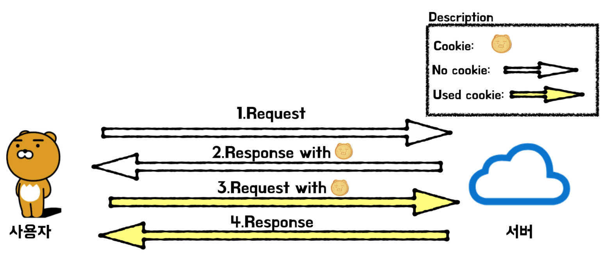

## **Cookie** & **Session**

HTTP 프로토콜의 특징이자 약점을 보완하기 위해 사용된다.

**HTTP 프로토콜의 특징**

1. **Connectionless (비연결성)**
    
    클라이언트가 서버에 요청을 했을 때, 그 요청에 맞는 응답을 받은 후 **연결이 끊어지는** 처리방식이다.
    
2. **Stateless (무상태성)**
    
    연결을 끊는 순간 클라이언트와 서버의 통신이 끝나며 **상태 정보는 유지하지 않는** 특성이 있다.
    
    → 첫 번째 통신에서 데이터를 주고받았다 해도, 두 번째 통신에서 이전 데이터를 유지하지 않는다. 하지만, 실제로 데이터 유지가 필요한 경우가 많다.
    

> 정보가 유지되지 않으면, 매번 페이지를 이동할 때마다 로그인을 다시 하거나,
상품을 선택했는데 구매 페이지에서 선택한 상품의 정보가 없거나 하는 등의 일이 발생할 수 있다.
→ 따라서, Stateless 경우를 대처하기 위해 **쿠키와 세션**을 사용한다.
> 

---

## 쿠키(Cookie)

사용자가 어떠한 웹 사이트를 방문할 경우, 그 사이트가 사용하고 있는 서버에서 **사용자의 컴퓨터(클라이언트)에 저장하는 작은 기록 정보 파일**이다.

- **구성**
    - 이름 : 쿠키를 구별하는 이름
    - 값 : 쿠키에 저장되는 값
    - 유효시간 : 쿠키 유지시간
    - 도메인 : 쿠키를 전송할 도메인
    - 경로 : 쿠키를 전송할 요청 경로
- **특징**
    - 사용자가 따로 요청하지 않아도 브라우저가 Request시에 Request Header를 넣어서 **자동으로 서버에 전송**한다.
    - 유효시간을 설정할 수 있으며, 유효시간이 만료되거나 사용자가 삭제하기 전까지는 데이터가 소멸되지 않는다.
    - 클라이언트의 리소스를 사용하기 때문에 서버의 부하가 적다.
- **동작 순서**
    
    
    
    1. 클라이언트가 페이지를 서버에 요청(request)한다. (사용자가 웹사이트에 접근)
    2. 서버는 쿠키를 생성한다.
    3. 생성한 쿠키에 정보를 담아, HTTP 헤더에 쿠키를 실어서 응답한다.
    4. 넘겨받은 쿠키는 클라이언트가 가지고 있다가 다시 서버에 요청할 때 HTTP 헤더에 실어서 **쿠키를** **함께 전송**한다.
    5. **서버는 함께 전송받은 쿠키를 확인하여 클라이언트를 식별할 수 있다.**
    6. 동일 사이트 재방문 시 클라이언트의 PC에 해당 쿠키가 있는 경우, 요청 페이지와 함께 쿠키를 전송한다.
    
    
    
- **사용 예시**
    - 방문 사이트에서 로그인 시, "아이디와 비밀번호를 저장하시겠습니까?"
    - 팝업창을 통해 "오늘 이 창을 다시 보지 않기" 체크
    - 이후 다른 요청을 해도 쿠키를 통해 팝업 창이 뜨지 않는다.
- **단점**
    - **보안에 취약**
        
        → 쿠키의 값을 브라우저에서 확인할 수 있어, 유출 및 조작 당할 위험이 존재
        
    - 쿠키에는 용량 제한이 있어 많은 정보를 담을 수 없음
    - 웹 브라우저마다 쿠키에 대한 지원 형태가 다르기 때문에 브라우저 간 공유가 불가능
    - 쿠키의 사이즈가 커질수록 네트워크에 부하가 심해짐
    

---

쿠키는 데이터가 **클라이언트에 저장이 되기 때문에 보안에 취약점**을 가지고 있다.

이러한 점을 보완하기 위해 세션이 만들어졌다. 

## 세션(Session)

일정 시간 동안 같은 사용자(브라우저)로부터 들어오는 일련의 요구를 하나의 상태로 보고, 그 상태를 유지시키는 기술이다. 여기서 일정 시간은 **방문자가 웹 브라우저를 통해 웹 서버에 접속한 시점부터 웹 브라우저를 종료하여 연결을 끝내는 시점**을 말한다.

즉, **방문자가 웹 서버에 접속해 있는 상태를 하나의 단위로 보고 그것을 ‘세션’이라고 한다.** 

- **특징**
    - **세션은 쿠키를 기반으로 하지만, 쿠키와 다르게 서버에서 저장하고 관리한다.**
    - 서버에 저장되는 쿠키(=세션 쿠키)
    - **서버**에는 **세션 ID**를 저장하고, **클라이언트**에는 **세션 ID를 담은 쿠키**가 저장된다.
    - 각 클라이언트에 **고유 세션 ID**를 부여한다. **세션 ID로 클라이언트를 식별한다.**
    - 브라우저를 닫거나, 서버에서 세션을 삭제했을 때 삭제된다
    - 저장 데이터에 제한이 없다. (서버 용량이 허용하는 한에서)
    - 서버에서 관리하기 때문에 쿠키에 비해 **보안성이 좋다**
    - 일반적으로 **로그인 정보 유지**에 사용된다.

- **동작 순서**
    
    
    
    - 클라이언트가 서버에 페이지를 요청(request)한다. (사용자가 웹사이트에 접근)
    - 서버는 접근한 클라이언트의 Request-Header의 필드인 Cookie를 확인하여, 클라이언트가 해당 **세션 ID**를 보냈는지 확인한다.
    - **세션 ID**가 존재하지 않는다면, 서버는 **세션 ID**를 생성해 클라이언트의 쿠키에 담아 보내준다.
    - 클라이언트는 서버에 요청 시 **세션 ID**가 담긴 쿠키를 서버에 전달한다.
    - 서버는 전달 받은 **세션 ID**로 **클라이언트를 식별**하여 요청을 처리 후 응답한다.
        
        
        
- **사용 예시**
    - 화면을 이동해도 로그인이 풀리지 않고 로그아웃하기 전까지 유지
- **장단점**
    - 쿠키를 포함한 요청이 외부에 노출되더라도 **세션 ID 자체는 유의미한 개인정보를 담고 있지 않다.**
        
        (그러나 악의적인 공격자가 **세션 ID**를 탈취하여 사용자인 척 위장할 수 있다)
        
    - 각 사용자마다 고유한 세션 ID가 발급되기 때문에, 요청이 들어올 때마다 회원 정보를 확인 할 필요 없다
    - 서버에 세션 정보를 기록하고 있어야 하므로, 접속자가 많을 때 서버에 메모리 부하가 존재할 수 있다.

---

## **Cookie** vs **Session**

|  | 쿠키 | 세션 |
| --- | --- | --- |
| 저장 위치 | 클라이언트 로컬 (브라우저/개인 컴퓨터) | 서버 |
| 저장 형식 | Text | Object |
| 라이프 사이클 | 브라우저가 종료되어도, 만료시점 지나지 않으면 정보가 삭제되지 않음. 다시 사이트에 접속해도 정보가 남아있음 | 브라우저 종료되면, 정보가 삭제됨 |
| 사용하는 자원 | 클라이언트 리소스 | 서버 리소스 |
| 용량 제한 | 제한 있음, 총 300개, 하나의 도메인 당 20개, 하나의 쿠키 당 4KB | 서버가 허용하는 한 제한 없음 |
| 속도 | 빠름 | 느림 |
| 보안 | 안좋음 | 좋음 |
- 쿠키와 세션은 비슷한 역할을 하며, 동작 원리도 비슷하다. 그 이유는 세션도 결국 쿠키를 사용하기 때문이다.
- **사용자의 정보가 저장되는 위치**
    - **쿠키**는 **클라이언트** → 서버의 자원을 전혀 사용하지 않는다
    - **세션**은 **서버** → 서버의 자원을 사용한다
- **보안**
    - **쿠키**는 **클라이언트**에 저장되기 때문에 변질되거나 요청에서 스니핑을 당할 수 있어서 **보안에 취약하다.**
    - **세션**은 **서버**에 저장되기 때문에 비교적 **보안성이 높다.**
- **라이프 사이클**
    - **쿠키**도 만료기간이 있지만 파일로 저장되기 때문에 **브라우저를 종료해도 정보가 유지될 수 있다.** 또한 **만료기간을 따로 지정해 쿠키를 삭제할 때까지 유지할 수도 있다.**
    - **세션**도 **만료기간을 정할 수 있지만, 브라우저가 종료되면 만료기간에 상관없이 삭제된다.**
- 쿠키는 쿠키 자체에 정보가 있기 때문에 서버에 요청 시 속도가 빠르고, 세션은 정보가 서버에 있기 때문에 처리가 요구되어 비교적 느린 속도를 낸다.

*쿠키와 세션의 문제점들을 보완하기 위해, 토큰(Token)기반의 인증 방식이 도입

---

### 쿠키와 세션 그리고 캐시(Cache)

**캐시**는 웹 페이지 요소를 저장하기 위한 임시 저장소이고,**쿠키/세션**은 정보를 저장하기 위해 사용된다.

**캐시**는 웹 페이지를 빠르게 렌더링 할 수 있도록 도와주고,**쿠키/세션**은 사용자의 인증을 도와준다.

- 캐시는 이미지, 비디오, 오디오, css, js파일 등 데이터나 값을 미리 복사해 놓는 리소스 파일들의 임시 저장소이다.
- 저장 공간이 작고 비용이 비싼 대신, 빠른 성능을 제공한다.
- 같은 웹 페이지에 접속할 때 사용자의 PC에서 로드하므로 서버를 거치지 않아도 된다.
- 이전에 사용된 데이터가 다시 사용될 가능성이 많으면 캐시 서버에 있는 데이터를 사용한다.
    
    → 그래서 다시 사용될 확률이 있는 데이터들이 빠르게 접근할 수 있어진다. (페이지의 로딩 속도 ↑)
    
- 캐시 히트(hit) : 캐시를 사용할 수 있는 경우 (ex. 이전에 왔던 요청이랑 같은 게 왔을 때)
- 캐시 미스(miss) : 캐시를 사용할 수 없는 경우 (ex. 웹서버로 처음 요청했을 때)
