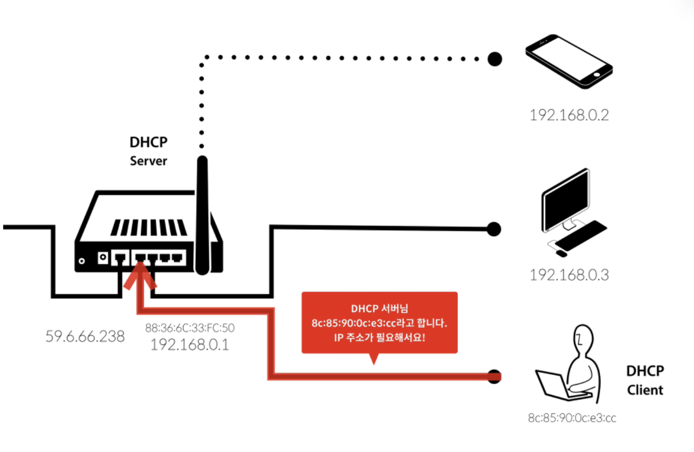
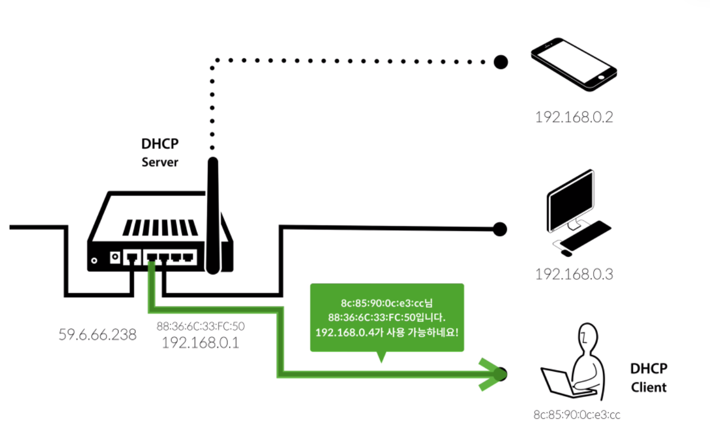
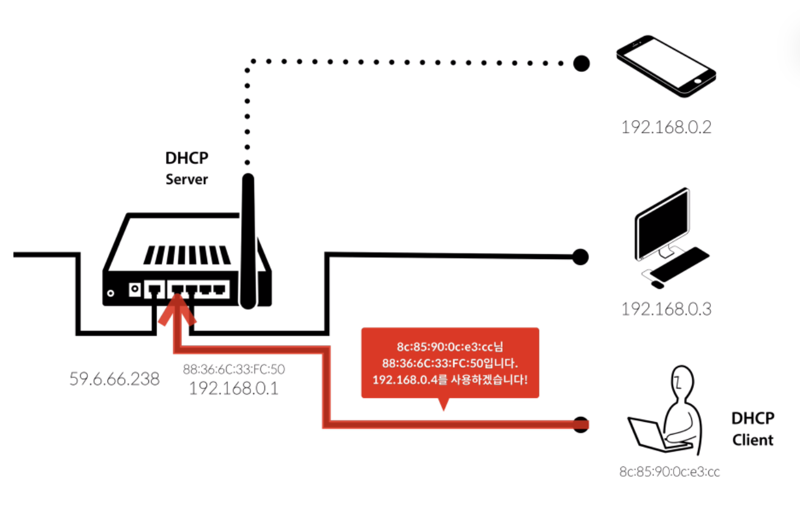
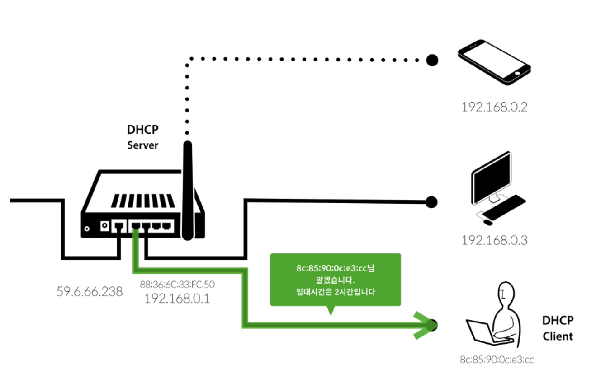

DHCP란 ‘Dynamic Host Configuration Protocol’의 약자로, IP 네트워크에 사용되는 네트워크 프로토콜입니다. DHCP는 **IP 주소 및 기타 통신 매개변수를 네트워크에 연결된 장치에 자동으로 할당**합니다. 대부분의 가정용 네트워크에서는 ****라우터**가 IP 주소를 장치에 할당하는 DHCP 서버의 역할을 합니다.

DHCP는 네트워크 관리자가 해야 할 작업을 간소화합니다. DHCP 사용 없이는 수동으로 IP 주소를 할당해야 합니다. DHCP 설정 없이 수동으로 IP 주소를 할당하면 비효울적이고 시간이 지나치게 많이 소요되며 오류가 발생할 가능성이 높습니다.

**1. 공유기에 노트북을 LAN으로 연결하면 자동으로 DHCP Client의 MAC 주소(8c:85...)가 DHCP Server에게 IP 주소를 요청한다.**

**2. DHCP Server는 DHCP Client에게 사용 가능한 IP를 자동으로 할당한다. (단, DHCP를 통해 할당 받은 IP 주소는 영구적인 것이 아니다.)**

**4. 할당 받은 IP 주소를 사용하다가 임대 시간이 지나면 기간을 연장하거나 IP 주소를 반납한다.**

본래 이 IP 설정 과정은 매우 복잡해서 머리가 터져나갈 수 있으나, 라우터와 장치에 내장된 DHCP 기술 덕분에 이 과정이 자동으로 진행되어 편리하게 이용할수 있는 것이다.

