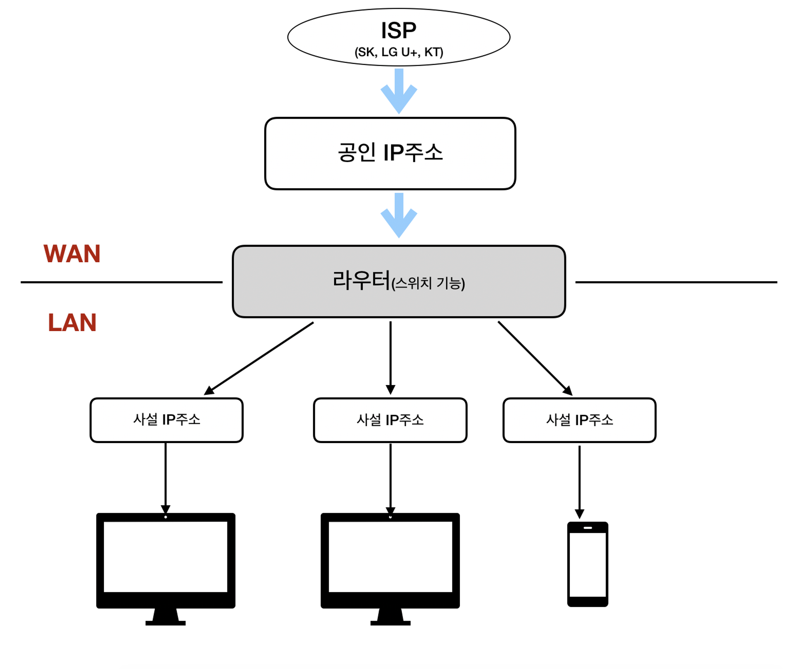
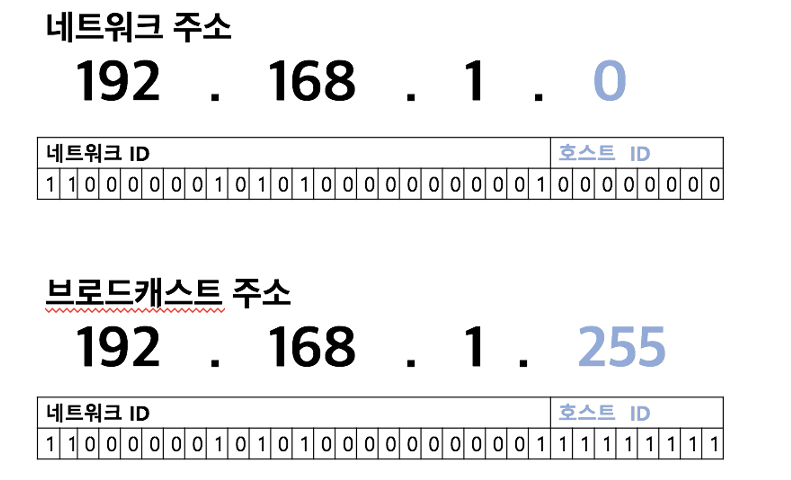

**네트워크 간의 통신을 하려면, IP 주소가 필요!**

### IP 주소란?

IP 주소는 **인터넷 서비스 제공자(ISP)** 에게 받을 수 있다. IP 버전에는 **IPv4**와 **IPv6**가 있다.

IP 주소에는 **공인 IP 주소**와 **사설 IP 주소**가 있다. 공인 IP 주소는 **인터넷 서비스 제공자(ISP)** 가 제공한다. **공인 IP 주소**와 **사설 IP 주소**는 모두 2진수의 **32비트**를 동일하게 사용하고 있다.

> IP 주소가 왜 두 종류나 필요할까?
> 
> 
> IPv4 주소는 위에서 말했듯이 주소의 수가 고갈되고 있다. 그래서 인터넷에 직접 연결되는 컴퓨터나 라우터에는 **공인 IP 주소**를 할당하고, 회사나 가정의 랜에 있는 컴퓨터는 **사설 IP 주소**를 할당하는 정책을 사용하고 있다.
> 

예를 들어 아래 사진과 같이 랜 안에 컴퓨터가 여러 대 있다면 공인 IP 주소는 사용할 수 있는 숫자가 제한되므로 컴퓨터 한 대당 공인 IP 주소를 하나씩 할당하기 어렵다. 그래서 우선 인터넷 서비스 제공자(ISP)가 제공하는 **공인 IP 주소**는 라우터에만 할당하고, **랜 안에 있는 컴퓨터에는 랜의 네트워크 관리자가 자유롭게 사설 IP 주소를 할당**하거나 라우터의 **DHCP 기능을 사용하여 IP 주소를 자동으로 할당**한다. 그러면 **공인 IP 주소 한 개로 랜 안에 있는 컴퓨터 세대에 인터넷을 모두 연결할 수 있는 환경**을 만들 수 있다.

> **DHCP**는 Dynamic Host Configuration Protocol의 약어로 IP 주소를 자동으로 할당하는 프로토콜 이다.
> 

> IP 주소는 **네트워크 ID**와 **호스트 ID**로 나눠져 있다.
> 
> 
> 네트워크 ID는 어떤 네트워크인지를 나타내고, 호스트 ID는 해당 네트워크의 어느 컴퓨터인지를 나타낸다. 이 두 가지 정보가 합쳐져, IP 주소가 된다.
> 

 

## IP 주소의 클래스 구조

**IP 주소는, 네트워크의 규모에 따라 A~E 클래스로 나누어져 있다.**

### IP 주소 클래스란?

IPv4의 IP 주소는 32비트다. 이 비트를 옥탯 단위로 끊어서 **네트워크 ID**를 크게 만들거나 **호스트 ID**를 작게 만들어 네트워크 크기를 조정할 수도 있다. 네트워크 크기는 **클래스**라는 개념으로 구분하고 있다.

| 클래스 이름 | 내용 | 네트워크 ID 크기 | 호스트 ID |
| --- | --- | --- | --- |
| A 클래스 | 대규모 네트워크 주소 | 8비트 | 24비트 |
| B 클래스 | 중형 네트워크 주소 | 16비트 | 16비트 |
| C 클래스 | 소규모 네트워크 주소 | 24비트 | 8비트 |
| D 클래스 | 멀티캐스트(multicast) 주소 | x | x |
| E 클래스 | 연규 및 특수용도 주소 | x | x |

| 종류 | 공인 IP 주소의 범위 | 사설 IP 주소의 범위 |
| --- | --- | --- |
| A 클래스 | 1.0.0.0~9.255.255.255 | 10.0.0.0~10.255.255.255 |
|  | 11.0.0.0~126.255.255.255 |  |
| B 클래스 | 128.0.0.0~172.15.255.255 | 172.16.0.0~172.31.255.255 |
|  | 172.32.0.0~191.255.255.255 |  |
| C 클래스 | 192.0.0.0~192.167.255.255 | 192.168.0.0~192.168.255.255 |
|  | 192.169.0.0~223.255.255.255 |  |

> 사설 IP 주소는, 절대로 공인 IP 주소로 사용할 수 없다
> 

> **가정의 랜**에서는, 주로 **C 클래스의 사설 IP 주소인 192.168.ㅁ.ㅁ**이다. (네트워크 ID.호스트 ID)
> 

 

## 네트워크 주소와 브로드캐스트 주소의 구조

### 네트워크 주소와 브로드캐스트 주소란?

IP 주소에는 **네트워크 주소**와 **브로드캐스트 주소**가 있다.

> 이 두 주소는 특별한 주소로, 컴퓨터나 라우터가 자신의 IP로 사용하면 안된다.
> 

**예를 들어** C 클래스 사설 IP 주소가 있다고 가정하자.

그러면 IP 주소의 범위는 192.168.0.0~192.168.255.255이다. 이것은 256개의 네트워크 ID에, 각각 호스트 ID가 256개가 있는 것이다. 그럼 이제 아래 사진을 보자.

이 사진은 256개의 네트워크 ID 중에서 하나인, 192.168.1.0~192.168.1.255 (→ 같은 네트워크!) 부분이다. 같은 네트워크 ID의 호스트 주소이므로 네트워크 주소는 192.168.1로 당연히 같다. 그러면 이제 **첫 번째 호스트 ID인 192.168.1.0**은 **네트워크 주소**이고, **마지막 호스트 ID인 192.168.1.255**는 **브로드캐스트 주소**이다.

**네트워크 주소**는 전체 네트워크에서 **작은 네트워크**를 식별하는 데 사용되고, 호스트 ID가 10진수로 0이면 그 **네트워크 전체를 대표하는 주소**가 되는거다. 쉽게 말해 전체 네트워크 대표 주소라고 생각하자.

**브로드캐스트 주소**는 네트워크에 있는 컴퓨터나 장비 모두에게 **한 번에 데이터를 전송**하는 데 사용되는 전용 IP 주소다. **예를 들어** 192.168.1.1의 데이터를 192.168.1.2~192.168.1.254 모두에게 전송하고 싶으면, 전송할 데이터를 192.168.1.255에게 보내면 된다.