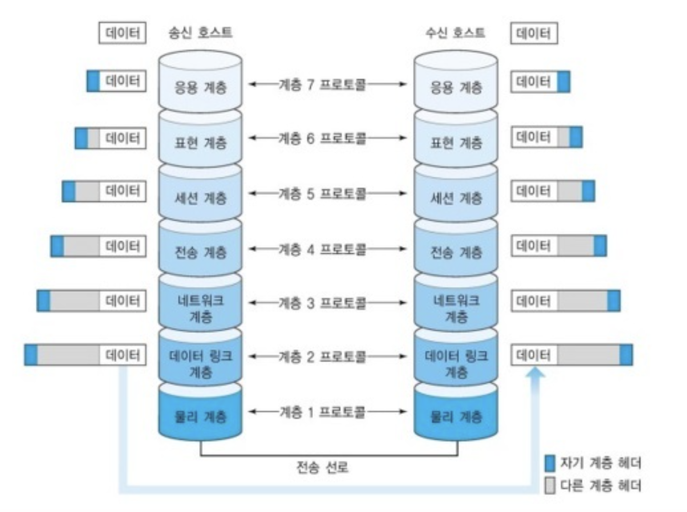

## OSI 7 계층

- **네트워크에서 통신이 일어나는 과정을 7단계로 나눈 것**
- 계층 모델에 의해 **프로토콜도 계층별로 구성됨**
- 실제 인터넷에서 사용되는 **TCP/IP 계층은 OSI 7 계층을 기반으로 상업적이고 실무적으로 이용될 수 있도록 단순화**한 것
    
    
    
- OSI 7 계층을 나눈 이유는 **통신이 일어나는 과정을 단계별로 파악할 수 있고, 통신 과정 중 특정한 곳에 이상이 생길 경우 다른 단계와 독립적으로 통신 장애를 일으킨 단계에서 해결할 수 있기 때문이다**
    - 예시 상황
        
        게임을 하다가 네트워크 접속이 끊긴 상황을 생각해 보자.
        
        1. 랜선이 뽑혀 있거나, 통신 케이블(선)이 끊어져 있었다면?
            
            → **물리 계층**에서 문제가 있었던 것이다.
            
        2. 라우터의 발열 문제가 있어 재부팅을 해야 했다면?
            
            → **네트워크 계층**에서 문제가 있었던 것이다.
            
- 전송 시, 7계층→1계층으로 각각의 층마다 인식할 수 있어야 하는 헤더를 붙임 (캡슐화)
- 수신 시, 1계층→7계층으로 헤더를 떼어냄 (디캡슐화)
    
    
    

***프로토콜이란**

프로토콜이란 메시지를 주고 받는 양식이나 규칙을 의미하는 **통신 규약**이다.

시스템 간 메시지를 주고 받기 위해서는 한쪽에서 보낸 메시지를 반대쪽에서 이해할 수 있어야 한다. 사람이 대화할 때 한쪽에서 '안녕' 이라는 메시지를 보냈을 때 인사로 알아듣고 대답으로 '안녕' 이라는 메시지를 보낼 수 있어야 하는 것 처럼, 통신 모델에서도 메시지를 주고 받으며 통신할 때 그 언어와 대화 방법에 대한 규칙이 있어야 의사소통을 할 수 있을 것이다. 이 규칙을 정의한 것이 프로토콜이고 이 규칙은 **계층별로 다르게 존재**한다.

---

## OSI 7 계층의 구조

### [1] Physical Layer (물리 계층)

데이터 단위는 `bit`

- 전기적, 기계적인 특성을 이용해서 통신 케이블로 데이터를 전송하는 계층
- **장비** - 케이블, 허브, 리피터

### [2] Data Link Layer (데이터 링크 계층)

데이터 단위는 `frame`

- 물리 계층을 이용해, 한 네트워크 요소에서 이웃 네트워크 요소로 데이터를 전송하는 계층
- **MAC 주소**를 이용해 통신
- 네트워크 계층과 다르게, 직접적으로 연결된 장치와의 통신에 중점을 둔다
- **프로토콜** - Ethernet, Wifi
- **장비** - 스위치, 브릿지

### [3] Network Layer (네트워크 계층)

데이터 단위는 `packet`

- 데이터를 한 host에서 다른 host로 **라우팅**하는 계층
- 라우터를 통해 이동할 경로를 선택하여 IP 주소를 지정하고, 해당 경로에 따라 `packet`을 전달해준다
- 여러 개의 노드를 거칠 때마다 경로를 찾아주는 역할
- **IP 주소**를 이용해 통신
- **프로토콜** - IP
- **장비** - 라우터

### [4] Transport Layer (전송 계층)

데이터 단위는 `segment`

- 양 끝단 간(end-to-end) 신뢰성 있고 정확한 데이터 전송을 담당하여, 상위 계층들이 데이터 전달의 유효성이나 효율성을 생각하지 않도록 해준다
    - 오류 검출 및 복구, 흐름제어와 중복검사 등을 수행
- **프로토콜** - TCP, UDP

### [5] Session Layer (세션 계층)

- 통신 장치 간 상호작용 및 동기화를 제공하는 계층
- 네트워크 상 양쪽 연결을 관리하고 연결을 지속시켜주는 계층
    - 세션 계층의 프로토콜은 통신 연결이 손실되는 경우 연결 복구를 시도하며 연결 시도중 오랜 시간 연결이 되지 않으면 세션 계층의 프로토콜이 연결을 닫고 다시 연결을 시도한다.
- 우리가 흔히 부르는 '세션 관리'가 일어난다. 또한 연결된 세션에서 에러로 중단된 통신에 대한 에러 복구와 재전송을 수행한다.

### [6] Presentation Layer (표현 계층)

- 데이터의 표현 방식이 다른 애플리케이션 시스템 간의 통신을 돕기 위해 하나의 통일된 데이터 형식으로 변환 → **데이터 형식상의 차이를 다루는 부담을 덜어준다**
- 데이터를 인코딩/디코딩, 압축/압축 풀기, 암호화/복호화
- **프로토콜** - ASCII, MPEG

### [7] Application Layer (응용 계층)

- 사용자에게 가장 가까운 계층이며 웹 브라우저, 응용 프로그램을 통해 사용자와 직접적으로 상호작용한다
- 파일 전송, DB, 메일 전송 등 여러 가지 응용 서비스를 네트워크에 연결해주는 역할
- **프로토콜** - HTTP, FTP(파일 업로드/다운로드)