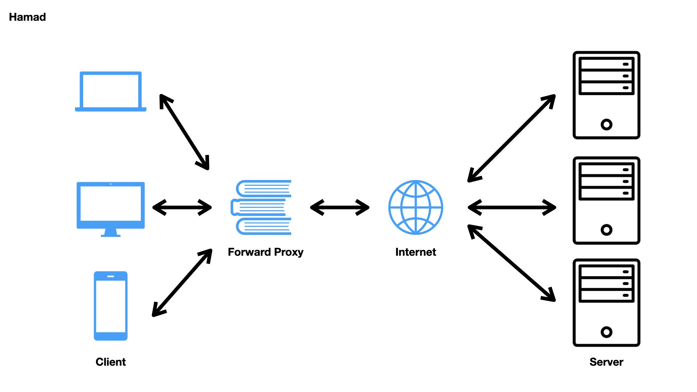

## Proxy Server

- 프록시(Proxy) → '대리'(남을 대신하여 일을 처리함)라는 의미를 갖고 있음
- **클라이언트와 서버 간의 중계 서버로, 통신을 대리 수행하는 서버**
- **캐시/보안/트래픽 분산** 등 여러 장점을 가질 수 있음

### 종류

프록시 서버는 네트워크 상 어디에 위치하느냐, 혹은 어느 방향으로 데이터를 제공하느냐에 따라 **Forward Proxy**와 **Reverse Proxy**로 나뉘게 된다.

**[Forward Proxy]**

> 우리가 흔히 말하는 ‘프록시 서버’란 바로 Forward Proxy 서버를 의미하는 것이다.
> 

- 그림처럼 **클라이언트 바로 뒤에** 놓여 있다.
- 같은 내부망에 존재하는 클라이언트의 요청을 받아 인터넷을 통해 외부 서버에서 데이터를 가져와 클라이언트에게 응답해준다.
- 즉, 클라이언트가 서버에 접근하고자 할때, 클라이언트는 타겟 서버의 주소를 Forward Proxy에 전달하여, Forward Proxy가 인터넷으로 요청된 내용을 가져오는 방식이다.
- 예를 들어, 우리가 naver.com을 요청하면 Forward Proxy 서버가 naver.com 리소스를 대신 받아와 클라이언트에게 내밀어준다(forward)고 생각하면 된다.

**Forward Proxy 특징**

- **클라이언트 보안 (Security)**
    
    보통 정부, 학교, 기업 등과 같은 기관은 해당 기관에 속한 사람들의 제한적인 인터넷 사용을 위해 방화벽을 사용한다.
    
    Forward Proxy 서버는 **방화벽**과 같은 개념으로 제한을 위해 사용 된다고 보면 된다.
    
    즉, 해당 기관에 속한 사람들이 그들이 방문하고자 하는 웹사이트에 직접적으로 방문하는 것을 방지할 수 있다. 예를 들어, Forward Proxy 서버에 룰을 추가해서 **특정 사이트에 접속하는 것을 막을 수 있다.**
    
- **캐싱 (Caching)**
    
    우리가 어떤 웹 페이지에 접근하면 프록시 서버는 해당 페이지 서버의 정보를 캐싱(임시보관)해둔다.
    
    그래서 똑같이 해당 페이지에 접근하거나, 다른 클라이언트가 해당 페이지를 요청할 때 , 캐시된 정보(페이지)를 그대로 반환할 수 있다. 이렇게 프록시 서버에 요청된 내용들을 캐시를 이용하여 저장하면 **전송시간도 절약**할 수 있음은 물론 동시에 **불필요하게 외부와의 연결을 하지 않아도 된다**는 장점을 가지게 된다. 또한 **외부와의 트래픽을 줄이게 됨으로써 네트워크 병목현상을 방지** 할 수 있다는 이점 또한 있다.
    
    위의 그림에서 만일 4명의 클라이언트가 naver.com에 접근할때 본래는 각각 따로 인터넷을 경유해서 네이버 페이지를 받겠지만, Forward Proxy를 이용하면 **프록시 내 캐싱 된 네이버 페이지를 불러오기 때문에 훨씬 빠르게 조회**할수 있는 원리이다.
    
- **암호화 (Encryption)**
    
    클라이언트의 요청은 **Forward Proxy 서버를 통과할 때 암호화**된다.
    
    암호화된 요청은 다른 서버를 통과할 때 필요한 최소한의 정보만 갖게 되는데, 이는 **클라이언트의 IP를 (보안을 위해) 감춰주는 보안 효과**를 내준다.
    
    따라서 본 서버에서 IP 주소를 역추적해도 Forward Proxy 서버를 사용하면  정체를 파악하기 어렵게 된다. 왜냐하면 IP 추적해도 Forward Proxy 서버 IP만 보이기 때문이다.
    
    **서버가 받은 요청 IP = Proxy IP** (Client IP X)
    
    
    
    위의 그림에서, 클라이언트 1,2,3이 인터넷과 직접적으로 통신하게 되면 IP가 직접적으로 인터넷에 드러나게된다. 이는 보안적으로 취약할 수 밖에 없다.
    
    **중간에 프록시 서버를 둔다면, 인터넷 서버는 프록시 서버와 통신하기 때문에 클라이언트들의 IP를 알 수 없게 된다!**
    

**[Reverse Proxy]**

> 여기서 Reverse는 '역전, 거꾸로'가 아닌 '배후, 뒷쪽'의 뜻
> 

- 그림처럼 **웹서버/WAS 앞에 놓여 있는 것**을 말한다.
- 클라이언트는 웹서비스에 접근할때 웹서버에 요청하는 것이 아닌, 프록시로 요청하게 되고, 프록시가 배후(reverse)의 서버로부터 데이터를 가져오는 방식이다.
- 클라이언트쪽으로 데이터(response)를 밀어주는게 Foward Proxy라면, 그 반대편인 서버 쪽으로 데이터(request)를 밀어주는 것이 Reverse Proxy라고 보면 된다.

**Reverse Proxy 특징**

- **로드 밸런싱 (Load Balancing)**
    
    유명한 웹 사이트는 하루에도 수백만명이 방문한다. 그리고 그러한 대량의 트래픽을 하나의 싱글 서버로 감당해 내기란 어렵다.
    
    하지만 Reverse Proxy 서버를 여러개의 본 서버들 앞에 두면 특정 서버가 과부화 되지 않게 **로드밸런싱**이 가능하다.
    
- **서버 보안 (Security)**
    
    Reverse Proxy를 사용하면 **본래 서버의 IP 주소를 노출시키지 않을 수 있다.** 
    
    따라서 해커들의 DDoS 공격과 같은 공격을 막는데 유용하다.
    
    위의 그림에서 보면, 클라이언트는 인터넷을 통해 Reverse Proxy 서버 url에게 요청을 한다. 그리고 Reverse Proxy는 본서버에게 요청을 경유해서 보내게 된다. 이렇게 되면 클라이언트는 본 서버의 url을 모른채 Reverse Proxy url을 통해 서비스를 이용하게 되고, 이는 즉 본서버의 정보를 숨기는 효과가 된다.
    
- **캐싱 (Caching)**
    
    만약 어떤 한국에 있는 유저가 미국에 웹서버를 두고 있는 사이트에 접속할때, Reverse Proxy 서버가 한국에 있다고 해보자.
    
    그러면 한국에 있는 유저는 한국에 있는 Reverse Proxy 서버와 통신해서 리버스 프록시 서버에 캐싱되어 있는 데이터를 사용할 경우에는 더 빠른 성능을 보여줄수 있다.
    
    **포워드 프록시의 캐싱과 비슷한 기능**을 한다고 보면 된다. (정확히 프록시의 본래 기능)
    
- **암호화 (Encryption)**
    
    SSL 암호화에도 좋다.
    
    본래 서버가 클라이언트들과 통신을 할때 SSL(or TSL)로 암호화, 복호화를 할 경우 비용이 많이 들게 된다.
    
    그러나 리버스 프록시를 사용하면 **들어오는 요청을 모두 복호화하고 나가는 응답을 암호화**해주므로 클라이언트와 안전한 통신을 할수 있으며 본래 서버의 부담을 줄여줄 수 있다.
    

### Foward Proxy vs Reverse Proxy 차이점

**프록시 서버 위치**

- Forward Proxy 서버는 **클라이언트 앞**에 놓여있다
- Reverse Proxy 서버는 **웹서버/WAS 앞**에 놓여 있다

**프록시 서버 통신 대상**

- Forward Proxy는 내부망에서 **클라이언트와 Proxy 서버가 통신**하여 인터넷을 통해 외부에서 데이터를 가져온다.
- Reverse Proxy는 내부망에서 **Proxy 서버와 내부망 서버가 통신**하여 인터넷을 통해 요청이 들어오면 Proxy 서버가 받아 응답해준다.

**감춰지는 대상**

- Forward Proxy는 직접 서버 url로 요청을 보내지만, Reverse Proxy는 프록시 서버 url로만 접근이 가능하다.
이로써 **Reverse Proxy는 본서버의 IP 정보를 숨길수 있는 효과**를 얻게 된다.
- Forward Proxy는 내부망에서 인터넷 상에 있는 서버에 요청할때 먼저 Foward Proxy 서버를 호출하고 프록시가 서버에게 요청을 보내게 되는데, 이로서 **서버에게 클라이언트가 누구인지 감출수 있다.**
즉, 서버 입장에서 응답받은 IP는 포워드 Forward Proxy의 IP이기 때문에 클라이언트가 누군지 알 수 없다.
