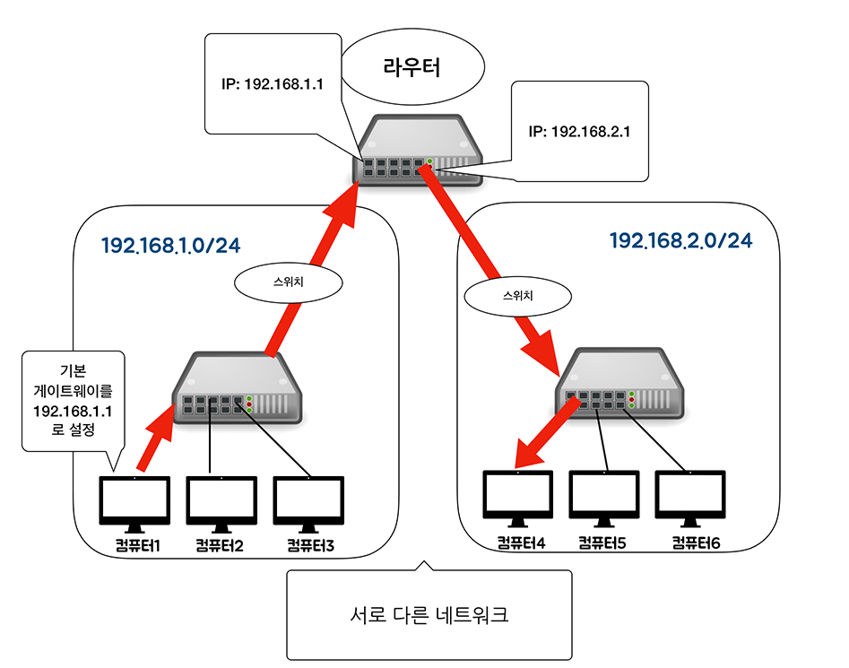
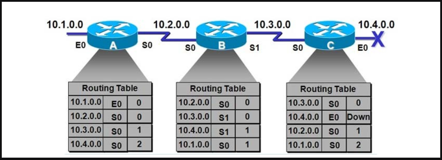

### 1. 라우터란?

- 서로 다른 네트워크와 통신하려면 라우터가 필요하다. 라우터는 **네트워크를 분리할 수 있다**.

-  컴퓨터가 다른 네트워크에 데이터를 전송하려면, **‘라우터’의 IP 주소**를 설정해야 한다. 이것은 **네트워크의 출입구를 설정**하는 것으로 **기본 게이트웨이(default gateway)**라고 한다.

***Q. ‘라우터’의 IP 주소는 왜 지정해야 할까?***

컴퓨터가 다른 네트워크로 데이터를 보낼 때 어디로 전송해야 하는지 알지 못한다. 그래서 **네트워크 출입구**를 지정하고, **일단 라우터로 데이터를 전송**한다. 

### 2. 라우팅이란?

**라우팅**은 경로 정보를 기반으로 현재의 네트워크에서 다른 네트워크로 최적의 **경로**를 통해 데이터를 전송한다고 했다. 이 경로 정보가 등록되어 있는 테이블이 **라우팅 테이블**이다.

**라우터**는, 자신의 **라우팅 테이블**과 **목적지 IP 주소**를 비교한다. 라우팅 테이블에서 목적지 IP 주소의 경로를 알 수 있으면 **라우팅**을 할 수 있다.

**라우팅 테이블은 어떻게 등록할까?**

네트워크 관리자가 수동으로 등록하는 방법과 자동으로 등록하는 방법이 있다. **수동으로 등록하는 방법**은 소규모 네트워크에 적합하고, **자동으로 등록하는 방법**은 대규모 네트워크에 적합하다.

**수동으로 등록하는 방법**은 대규모 네트워크에서는 정보를 하나하나 라우터에 등록하기가 힘들기 때문이다. 또 등록된 내용이 수정되면 수동으로 변경해야 해서 작업량도 많아진다.

한편 **자동으로 등록하는 방법**은 라우터 간에 경로 정보를 서로 교환하여 라우팅 테이블 정보를 자동으로 수정해준다. 수동으로 등록하는 방법처럼 직접 네트워크 관리자가 변경하지 않아도 되기 때문에 훨씬 편하다.

