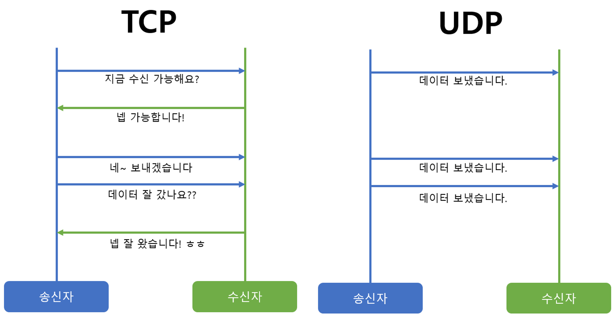
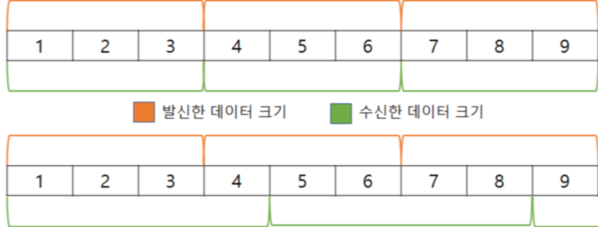

## TCP & UDP

Transport Layer (전송 계층)에서 사용되는 프로토콜

## TCP (Transmission Control Protocol)

- 연결 지향형으로, 신뢰성 있는 데이터 전송을 지원하는 프로토콜
- **3 Way Handshaking** 과정을 통해 연결 설정 후 통신을 시작
- 흐름 제어와 혼잡 제어를 지원하여, 데이터(packet)의 순서를 보장한다. 하지만 이 때문에 UDP보다 전송 속도가 느리다.
    - 흐름 제어 : 송신 측과 수신 측의 데이터 처리 속도의 차이를 조절
    - 혼잡 제어 : packet 수로 인해 네트워크에 overflow가 발생하지 않도록 조절
- 연속성보다 신뢰성 있는 전송이 중요할 때에 사용 (ex. WEB 통신, 이메일, 파일 전송)

### 특징

- 신뢰성 있게 데이터를 주고 받을 수 있다
- 데이터의 전송 순서를 보장한다
- 데이터의 경계가 존재하지 않는다
- **UDP**보다 전송 속도가 느리다
- 연결 설정/연결 해제 과정이 존재한다
    - **연결 설정**: 3 Way Handshaking
    - **연결 해제**: 4 Way Handshaking

***데이터의 경계**

데이터 경계란 데이터를 보낼 때 여러번에 걸쳐 보낼 수 있는지의 여부이다.

사진의 첫번째 경우처럼 송신 함수의 호출 횟수와 수신 함수의 호출 횟수가 일치 해야하는 경우는 **데이터의 경계가 있는 경우**이다.

반대로 두번째 경우는 송신 함수의 호출 횟수와 수신 함수의 호출 횟수가 일치 하지 않아도 되는 **데이터의 경계가 없는 경우**이다.

---

## UDP (User Datagram Protocol)

- 비연결형으로, 데이터를 보낸다는 신호를 거치지 않고 **일방적으로 데이터를 전달**하는 프로토콜
- TCP와 다르게 연결 설정이 없다
- 혼잡 제어를 거치지 않아 **TCP**보다 속도가 빠르지만, packet 손실이 발생할 수 있다
- 신뢰성이 낮지만 속도가 빠르다. 따라서 신뢰성보다는 연속성이 중요한 서비스에 사용한다. (ex. 실시간 스트리밍, 음성, 게임)

### 특징

- 비연결형
- 비신뢰성
- 데이터의 전송 순서를 보장하지 않는다
- 데이터의 경계가 존재한다
- packet의 부가적인 정보가 적어(오버헤드가 적어) 네트워크의 부하가 감소할 수 있다
- 혼잡 제어 과정이 없기 때문에, **TCP**보다 빠르다
- 연결 설정/연결 해제 과정이 존재하지 않는다

---

## TCP vs UDP

|  | TCP | UDP |
| --- | --- | --- |
| 연결 방식 | 연결형  | 비연결형  |
| 전송 순서 | 보장 | 변경될 수 있음 |
| 데이터 경계 | 구분하지 않음 | 구분 |
| 신뢰성 | 높음 | 낮음 |
| 전송 속도 | 느림 | 빠름 |
| 통신 | 1:1 | 1:1, 1:N, N:N |