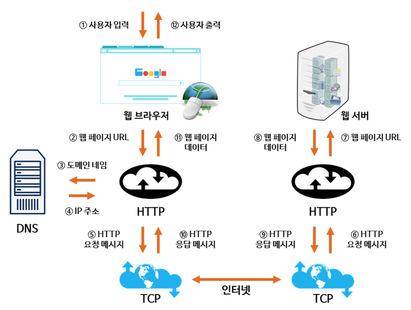
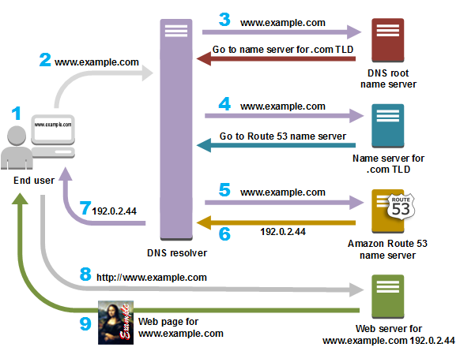

1. 사용자가 브라우저에 **도메인 네임**(www.naver.com)을 입력한다.
2. 사용자가 입력한 URL 주소 중에서 도메인 네임(Domain Name) 부분을 **DNS 서버**에서 검색하고, DNS 서버에서 해당 도메인 네임에 해당하는 **IP 주소**를 찾아 사용자가 입력한 URL 정보와 함께 전달한다.
3. 페이지 URL 정보와 전달받은 IP 주소는 HTTP 프로토콜을 사용하여 **HTTP 요청 메시지를 생성**하고, 이렇게 생성된 HTTP 요청 메시지는 TCP 프로토콜을 사용하여 인터넷을 거쳐 **해당 IP 주소의 컴퓨터(서버)** 로 전송된다.
4. 이렇게 도착한 HTTP 요청 메시지는 HTTP 프로토콜을 사용하여 웹 페이지 URL 정보로 변환되어 **웹 페이지 URL 정보에 해당하는 데이터**를 검색한다.
5. 검색된 웹 페이지 데이터는 또 다시 HTTP 프로토콜을 사용하여 **HTTP 응답 메시지를 생성**하고 TCP 프로토콜을 사용하여 인터넷을 거쳐 원래 컴퓨터로 전송된다.
6. 도착한 HTTP 응답 메시지는 HTTP 프로토콜을 사용하여 **웹 페이지 데이터**로 변환되어 웹 브라우저에 의해 출력되어 사용자가 볼 수 있게 된다.

# DNS 서버에서 IP 정보 수신

위의 과정을 통해 외부와 통신할 준비를 마쳤으므로, DNS Query를 DNS 서버에 전송한다. DNS 서버는 이에 대한 결과로 웹 서버의 IP 주소를 사용자 PC에 돌려준다. DNS 서버가 도메인에 대한 IP 주소를 송신하는 과정은 약간 복잡하다.

> 과정 (www.naver.com 이라고 가정하자.)
> 

사용자의 PC는 가장 먼저 지정된 **DNS 서버**(우리나라의 경우, 통신사별로 지정된 DNS 서버가 있다.)에 DNS Query를 송신한다. 

그 후 지정된 DNS 서버는 **Root 네임서버**에 www.naver.com을 질의하고, Root 네임서버는 **.com 네임서버의 ip 주소**를 알려준다.

그 후 **.com 네임서버**에 www.naver.com을 질의하면 **naver.com 네임서버의 ip 주소**를 받고, 

그곳에 질의를 또 송신하면 www.naver.com을 IP 주소를 수신하게 된다.

이와 같이 여러번 왔다갔다 하는 이유는, 도메인의 계층화 구조에 따라 DNS 서버도 계층화 되어있기 때문이다. 이렇게 계층화되어 있으므로 도메인의 가장 최상단, 즉 가장 뒷쪽(.com, .kr 등등)을 담당하는 DNS 서버는 전세계에 13개 뿐이다.